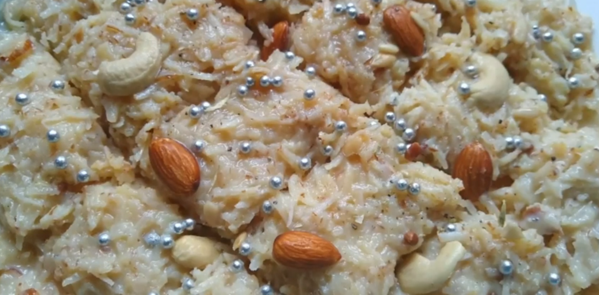

Nariyal ki Barfi is an Indian sweet which is very soft and delicious, and is an instant hit with everyone. This homemade style of making Instant Nariyal ki barfi is quite simple and easy to make. Preparation of this barfi requires less ingredients and all ingredients are easily available.

    

It is an Indian sweet that can be made in minutes. This nariyal ki barfi is the easiest festival sweet that anyone can prepare in their home. This recipe is made up of only three basic ingredients. This mouthwatering Nariyal ki Barfi is very healthy and yummy to eat.

Here is how to make this Instant Nariyal Ki Barfi.

    

        <dl class="row">
            <dt class="col-sm-4">Cuisine</dt><dd class="col-sm-7">North Indian</dd>
            <dt class="col-sm-4">Course</dt><dd class="col-sm-7">Dessert / Sweet / Mithai</dd>
            <dt class="col-sm-4">Diet</dt><dd class="col-sm-7">Vegetarian</dd>
            <dt class="col-sm-4">Equipments</dt><dd class="col-sm-7">Kadai (Wok) / Heavy Bottomed Pan</dd>
        </dl>
    

    

        <dl class="row">
            <dt class="col-sm-5">Prep. Time</dt><dd class="col-sm-7">15 mins</dd>
            <dt class="col-sm-5">Cooking Time</dt><dd class="col-sm-7">10 mins</dd>
            <dt class="col-sm-5">Total Time</dt><dd class="col-sm-7">25 mins</dd>
            <dt class="col-sm-5">Makes</dt><dd class="col-sm-7">2 Servings</dd>
        </dl>
    

<section>
    

    

        
<h5 class="font-weight-bold">Ingredients</h5>

    

    

        
            
            <ul style="line-height: 200%">
                <li>9-10 Almonds</li>
                <li>¼ tsp Cardamom Powder</li>
                <li>¼ cup Chironji</li>
                <li>8-9 Cashew Nuts(Kaju)</li>
                <li>¼ tsp Magaj seeds</li>
                <li>400 gm Milkmaid / Condensed Milk</li>
                <li>2 cups grated Coconut</li>
                <li>200 gm Khoya</li>
                <li>½ cup Ghee / Clarified Butter</li>
                <li>Silver coated sugar balls for decoration (Optional)</li>
            </ul>
        

    

</section>

        
<h5 class="font-weight-bold">Recipe Steps</h5>

    

    

    <ol class="text-justify" style="line-height: 200%">
        <li style="margin-bottom:5px;">Heat a Pan and add 2 tbsp ghee in it and toss all the dry fruits in it except cardamom powder. Transfer all dry fruits in a plate and keep it aside.</li>
        <li style="margin-bottom:5px;">In the same pan add grated khoya and cook this khoya for 3-4 minutes on low flame  till its consistency changes to creaminess.</li>
        <li style="margin-bottom:5px;">Now add milkmaid in the same pan and mix well.</li>
        <li style="margin-bottom:5px;">Add grated Coconut in this pan and mix all the ingredients very well.Add Magaz Seeds, Cardamom powder and Chirronji seeds in this mixture and mix well.</li>
        <li style="margin-bottom:5px;">Cut half of the fried Almonds and Cashew Nuts  and keep the other half aside for garnishing this Barfi.</li>
        <li style="margin-bottom:5px;">Add chopped almonds and cashew nuts in mixture and mix well.</li>
        <li style="margin-bottom:5px;">Cook this mixture for 3-4 minutes on low flame and continuously stir it.</li>
        <li style="margin-bottom:5px;">Grease ghee on a big plate.</li>
        <li style="margin-bottom:5px;">Now transfer this mixture on this plate and allow it to cool at room temperature.</li>
        <li style="margin-bottom:5px;">Garnish this nariyal ki barfi with any silver sugar balls, chopped almonds and cashew nuts.</li>
        <li style="margin-bottom:5px;">Keep this plate in the refrigerator and allow this barfi to set in it as this step helps in cutting pieces of Barfi easier.</li>
    </ol>
    

    

        

            <iframe width="100%" height="315" src="https://www.youtube.com/embed/isWhuAP-qJ0" frameborder="0" allow="accelerometer; autoplay; encrypted-media; gyroscope; picture-in-picture" allowfullscreen></iframe>
        

    

 
