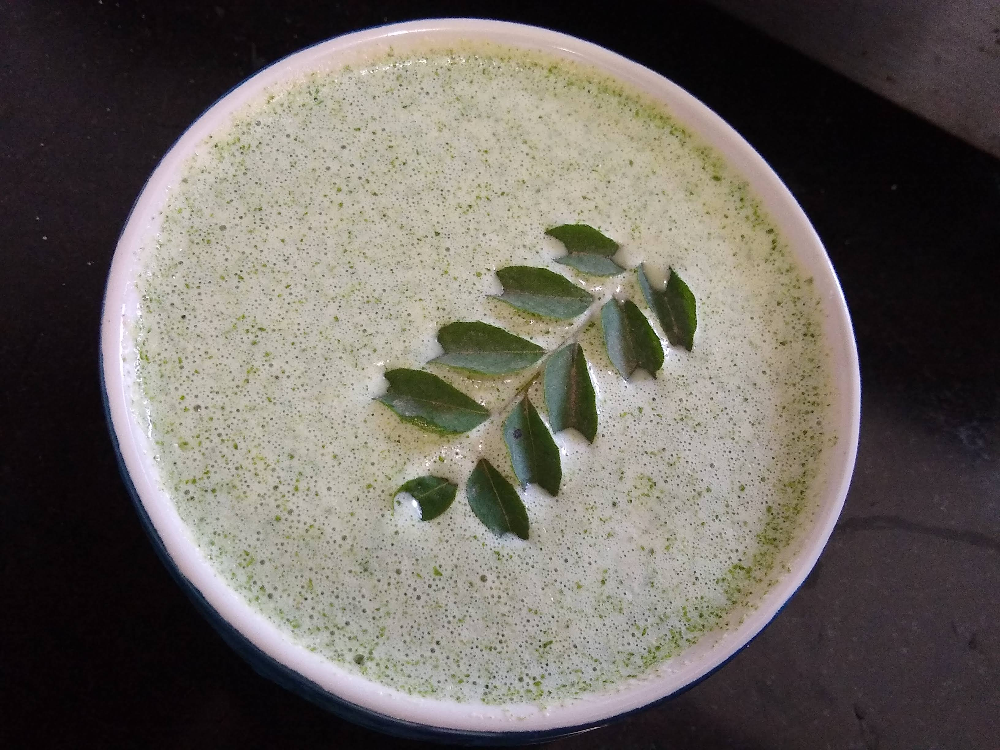

Chutneys are a gluten free, spicy and savory dish originating in India. Chutneys can be provided with any dish to balance the flavour of any food and increase the taste of any dish. Chutneys can be made from fruits, vegetables, herbs  with addition of salt, oil, sugar, different  aromatic spices like Cumin (Jeera), Fennel Seeds (Saunf), etc and any tangy item like lemon or vinegar.

    

Peanuts chutney or Mungfali ki Chutney is a spicy chutney, which is served as a side dish that can be used with several snacks and breakfast foods. This chutney is normally served with South indian dishes like  Idli, Pongal, Sambar and Vada. Enhancing the taste of any food which is served with this chutney.

Here is how to make this Peanuts chutney.

    

        <dl class="row">
            <dt class="col-sm-4">Cuisine</dt><dd class="col-sm-7">South Indian</dd>
            <dt class="col-sm-4">Course</dt><dd class="col-sm-7">Breakfast, Lunch and Dinner</dd>
            <dt class="col-sm-4">Diet</dt><dd class="col-sm-7">Vegetarian</dd>
            <dt class="col-sm-4">Equipments</dt><dd class="col-sm-7">Mixer Grinder / Silbatta and tadka pan</dd>
        </dl>
    

    

        <dl class="row">
            <dt class="col-sm-5">Prep. Time</dt><dd class="col-sm-7">5 mins</dd>
            <dt class="col-sm-5">Cooking Time</dt><dd class="col-sm-7">5 mins</dd>
            <dt class="col-sm-5">Total Time</dt><dd class="col-sm-7">10 mins</dd>
            <dt class="col-sm-5">Makes</dt><dd class="col-sm-7">2 Servings</dd>
        </dl>
    

<section>
    

    

        
<h5 class="font-weight-bold">Ingredients</h5>

    

    

        
            
            <ul style="line-height: 200%">
                <li>1 cup Peanuts</li>
                <li>Chopped coriander leaves</li>
                <li>¼ cup unskinned roasted chana dal</li>
                <li>4-5 cloves Garlic</li>
                <li>10-12 curry leaves</li>
                <li>3-4 Green chillies</li>
                <li>Pinch of Mustard Seeds</li>
                <li>Salt To taste</li>
                <li>1 tsp Oil</li>
            </ul>
        

    

</section>

        
<h5 class="font-weight-bold">Recipe Steps</h5>

    

    

    <ol class="text-justify" style="line-height: 200%">
        <li style="margin-bottom:5px;">Heat the pan and dry roast the Peanuts. Now Remove the skin of roasted peanuts and keep these peanuts aside in a plate.</li>
        <li style="margin-bottom:5px;">In a mixer Grinder or Silbatta add roasted Peanuts, roasted chana dal, garlic, green chilies, curry leaves (half quantity), salt and grind it into fine and smooth chutney.</li>
        <li style="margin-bottom:5px;">Take a tadka pan and add oil in it and add mustard seeds and curry leaves in it and add this tadka to chutney.</li>
    </ol>
    

    

        

            <iframe width="100%" height="315" src="https://www.youtube.com/embed/0d7j5T90BGw" frameborder="0" allow="accelerometer; autoplay; encrypted-media; gyroscope; picture-in-picture" allowfullscreen></iframe>
        

    

 