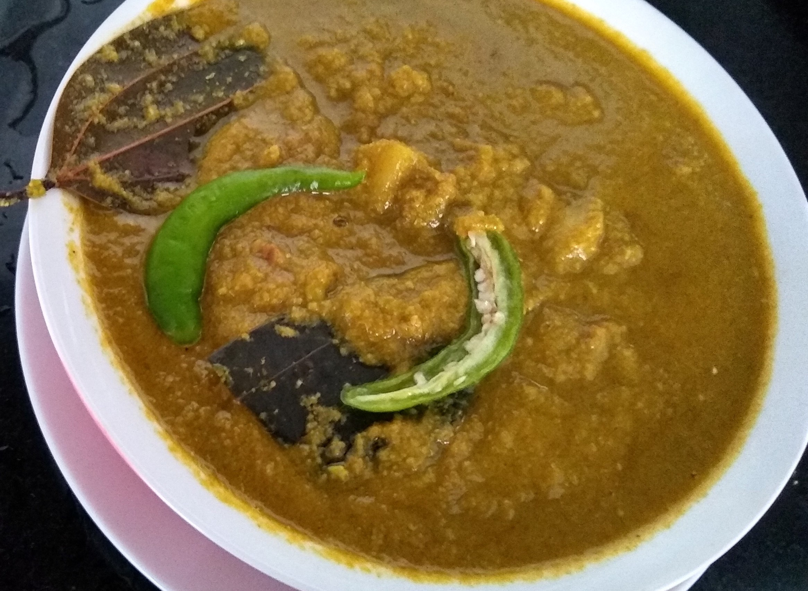

Green Peas are little pellets of nutrients. They may look small, but are loaded with nutrients and minerals. 

This matar recipe is a thick, spicy curry, delicious and rich when enjoyed with rice or rotis. Even though there are spices used, they can be kept at a minimal to actually let the peas shine through.

    

A dish widely prepared in Uttar Pradesh, this traditional UP style Matar Ka Nimona is made using peas and just a few spices. Make it with the most tender winter peas while they are in season. The dish is liked by my all family members. This recipe is very simple, easy to make, very delicious and can be made in large quantities if you have any get-together parties.

Here is how to make this matar recipe Matar ka Nimona.

    

        <dl class="row">
            <dt class="col-sm-4">Cuisine</dt><dd class="col-sm-7">North Indian (Awadhi)</dd>
            <dt class="col-sm-4">Course</dt><dd class="col-sm-7">Lunch and Dinner</dd>
            <dt class="col-sm-4">Diet</dt><dd class="col-sm-7">Vegetarian</dd>
            <dt class="col-sm-4">Equipments</dt><dd class="col-sm-7">Kadai (Wok) / Heavy Bottomed Pan</dd>
        </dl>
    

    

        <dl class="row">
            <dt class="col-sm-5">Prep. Time</dt><dd class="col-sm-7">15 mins</dd>
            <dt class="col-sm-5">Cooking Time</dt><dd class="col-sm-7">30 mins</dd>
            <dt class="col-sm-5">Total Time</dt><dd class="col-sm-7">45 mins</dd>
            <dt class="col-sm-5">Makes</dt><dd class="col-sm-7">2 Servings</dd>
        </dl>
    

<section>
    

    

        
<h5 class="font-weight-bold">Ingredients</h5>

    

    

        

            <ul style="line-height: 200%">
                <li>250 grams Green peas (Matar)</li>
                <li>Dried Urad Dal vadi</li>
                <li>1 Tejpatta</li>
                <li>1 Onion</li>
                <li>5-6 cloves of garlic</li>
                <li>1 Tomato</li>
                <li>Salt, to taste</li>
                <li>2 teaspoon Red chilli powder</li>
                <li>1 tablespoon Turmeric powder (Haldi)</li>
                <li>1-1/2 tablespoon Coriander Powder (Dhania)</li>
                <li>1/2 teaspoon Asafoetida (hing)</li>
                <li>1 + 2 tablespoon Cooking oil</li>
                <li>1 teaspoon Green Chillies, finely chopped</li>
                <li>1 patato cut in cubes</li>
                <li>3 spring Coriander (Dhania) Leaves, for garnishing</li>
            </ul>
        

    

</section>

    
<h5 class="font-weight-bold">Recipe Steps</h5>

    

        <ol class="text-justify" style="line-height: 200%">
            <li style="margin-bottom:5px;">To begin with Matar Ka Nimona, coarsely grind the peas in a blender using very little water and keep it aside.</li>
            <li style="margin-bottom:5px;">Make a onion, garlic and green chili paste.</li>
            <li style="margin-bottom:5px;">Make a tamato paste and keep it aside.</li>
            <li style="margin-bottom:5px;">Heat oil in kadai and add asafoetida and then add one Tejpatta. Now add onion, garlic and green chilli paste (prepared in Step 2) in kadai and let it cook on a low flame till the paste becomes lightly golden. Once it is done, switch off the heat.</li>
            <li style="margin-bottom:5px;">Now heat two tablespoon of oil in another pan and golden fry the Urad Dal vadis and stir fry the patato dices in same oil.</li>
            <li style="margin-bottom:5px;">Add turmeric powder, red chili powder, salt and coriander powder in masala cooking in kadai. Mix everything well and cook spices for 2-3 minutes.</li>
            <li style="margin-bottom:5px;">Once it is done, add tomato paste and cook it until oil separates from the gravy.</li>
            <li style="margin-bottom:5px;">Once the oil separates from the gravy, add green fried peas puree, vadis and patato dices and stir for 2-3 minutes till the mixture leaves the sides of the pan. (Do lot of bhunu the mixture).</li>
            <li style="margin-bottom:5px;">Add 1-1/2 cup water and cover kadai with lid and let it cook for 5 to 8 minutes. After 5-8 minutes, switch off the gas and sprinkle the garam masala and chopped coriander leaves.</li>
            <li style="margin-bottom:5px;">Serve hot yummy Matar Ka Nimona with Jeera Rice and / or chapati for a weekday lunch.</li>
        </ol>
    

    

        

            <iframe width="560" height="315" src="https://www.youtube.com/embed/S6SAIBX0b-4" frameborder="0" allow="accelerometer; autoplay; encrypted-media; gyroscope; picture-in-picture" allowfullscreen></iframe>
        

    

 
