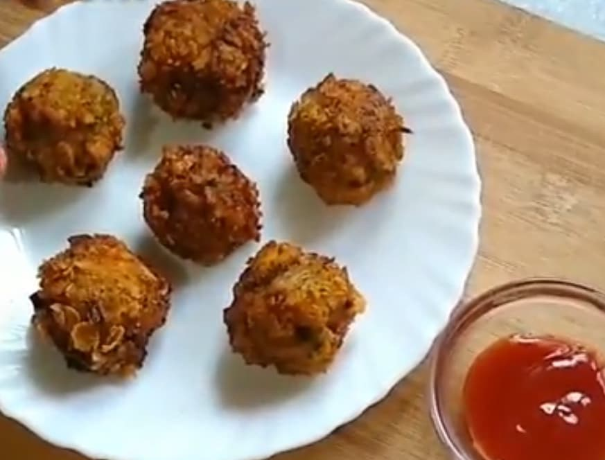

Broccoli is an edible green plant in the cabbage family whose large flowering head and stalk eaten as a vegetable.

    

Broccoli is low in calories but contain lots of nutrients and antioxidants that support many aspect of human health like improving bone health, preventing cancer, boosting immunity etc... Broccoli is a Superfood should be eaten by everyone especially children.

Lots of talks about benefits of broccoli, let's dive into the recipe.

A dish widely prepared in North India as a starter or appetizer. The dish is liked by my all family members. This recipe is very simple, easy to make and very delicious.

Here is how to make this Broccoli Cutlets

    

        <dl class="row">
            <dt class="col-sm-4">Cuisine</dt><dd class="col-sm-7">North Indian Starter</dd>
            <dt class="col-sm-4">Course</dt><dd class="col-sm-7">Breakfast, Lunch and Dinner</dd>
            <dt class="col-sm-4">Diet</dt><dd class="col-sm-7">Vegetarian</dd>
            <dt class="col-sm-4">Equipments</dt><dd class="col-sm-7">Kadai (Wok) / Heavy Bottomed Pan</dd>
        </dl>
    

    

        <dl class="row">
            <dt class="col-sm-5">Prep. Time</dt><dd class="col-sm-7">20 mins</dd>
            <dt class="col-sm-5">Cooking Time</dt><dd class="col-sm-7">20 mins</dd>
            <dt class="col-sm-5">Total Time</dt><dd class="col-sm-7">40 mins</dd>
            <dt class="col-sm-5">Makes</dt><dd class="col-sm-7">2 Servings</dd>
        </dl>
    

    
<h5 class="font-weight-bold">Ingredients</h5>

 

    

        <ul style="line-height: 200%">
            <li>1 cup very finely chopped broccoli</li>
            <li>1 small potato -Boiled and grated</li>
            <li>1/2 tsp oregano,1/2  tsp salt</li>
            <li>1/4 cup grated mozarella chesse</li>
            <li>1 small onion very finely chopped</li>
            <li>3 tsp oil</li>
            <li>oil for frying</li>
            <li>1 bread slice -grind into mixer to get fresh bread crumbs</li>
            <li>1 tsp garlic paste</li>
            <li>1 cup crushed cornflakes for coating</li>
            <li>4 tsp milk for coating</li>
        </ul>
    

    
<h5 class="font-weight-bold">Recipe Steps</h5>

    

        <ol class="text-justify" style="line-height: 200%">
            <li style="margin-bottom:5px;">Heat oil in a kadhai.Add onion and cook till soft.</li>
            <li style="margin-bottom:5px;">Add garlic paste and saute for 1 minute.</li>
            <li style="margin-bottom:5px;">Add oregano,salt,and  chopped broccoli.Cook for 3-4 minutes on low heat.Add Potato and mix well for 1-2 minutes.Remove from the gas stove.</li>
            <li style="margin-bottom:5px;">Put the mixture from pan to a mixing bowl and add  grated mozarella cheese and fresh bread crumbs.Mix well.Let the mixture come to room temperature.</li>
            <li style="margin-bottom:5px;">Now Shape them into small  round shaped cutlet, keep them aside.</li>
            <li style="margin-bottom:5px;">Crush cornflakes and spread on another plate.</li>
            <li style="margin-bottom:5px;">Moisten each Cutlet slightly with some milk.</li>
            <li style="margin-bottom:5px;">Roll each cutlet  in crushed cornflakes to cover the cutlet completely.</li>
            <li style="margin-bottom:5px;">Deep fry in hot oil.Serve them with green chutney and tomato kechup.</li>
            <li style="margin-bottom:5px;">Insert toothpic in each cutlet while plating.</li>
        </ol>
    

    

        

            <iframe width="560" height="315" src="https://www.youtube.com/embed/R_LY_gatT0k" frameborder="0" allow="accelerometer; autoplay; encrypted-media; gyroscope; picture-in-picture" allowfullscreen></iframe>
        

    

 