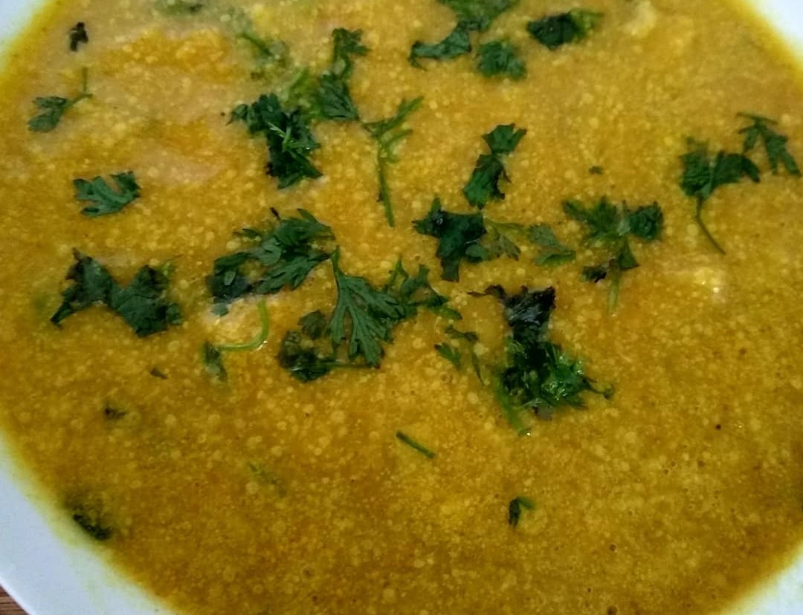

Karel is a simple and healthy lentil based curry which is served with hot Steam rice and chappati. Moong dal looks small, but are loaded with nutrients and minerals.

    

This recipe is a thick, spicy curry, delicious and rich when enjoyed with rice or rotis.

A dish widely prepared in Uttar Pradesh, this traditional UP style Moong Dal Spicy Curry is made using Moong dal and just a few spices. This recipe is very simple, easy to make, very delicious .Moong dal is low in calories, high in protein & easy digestable, hence this recipe is very common among vegeterians in their diet.

When there is no vegetable in your home then also you can make a perfect gravy dish that is Moong dal spicy curry / Karel.

Here is how to make this Moong Dal Spicy Curry

    

        <dl class="row">
            <dt class="col-sm-4">Cuisine</dt><dd class="col-sm-7">North Indian Starter</dd>
            <dt class="col-sm-4">Course</dt><dd class="col-sm-7">Lunch and Dinner</dd>
            <dt class="col-sm-4">Diet</dt><dd class="col-sm-7">Vegetarian</dd>
            <dt class="col-sm-4">Equipments</dt><dd class="col-sm-7">Kadai (Wok) / Heavy Bottomed Pan</dd>
        </dl>
    

    

        <dl class="row">
            <dt class="col-sm-5">Prep. Time</dt><dd class="col-sm-7">15 mins</dd>
            <dt class="col-sm-5">Cooking Time</dt><dd class="col-sm-7">25 mins</dd>
            <dt class="col-sm-5">Total Time</dt><dd class="col-sm-7">40 mins</dd>
            <dt class="col-sm-5">Makes</dt><dd class="col-sm-7">2 Servings</dd>
        </dl>
    

    
<h5 class="font-weight-bold">Ingredients</h5>

    

    

        <ul style="line-height: 200%">
            <li>1 cup yellow Moong Dal</li>
            <li>1 tablespoon Turmeric powder (Haldi)</li>
            <li>1 tablespoon Coriander Powder (Dhania)</li>
            <li>1 tablespoon Red Chilli Powder</li>
            <li>1/2 teaspoon Asafoetida (hing)</li>
            <li>Salt to taste</li>
            <li>2 + 2 tablespoon Cooking</li>
            <li>1 Onion finely chopped</li>
            <li>5-6 cloves of Garlic</li>
            <li>Chopped Coriander (Dhania) Leaves, for garnishing</li>
        </ul>
    

    
<h5 class="font-weight-bold">Recipe Steps</h5>

    

        <ol class="text-justify" style="line-height: 200%">
            <li style="margin-bottom:5px;">To begin with Karel ( Moong Dal Spicy Curry), coarsely grind the Moong Dal in a blender with very little water in it and keep it aside.</li>
            <li style="margin-bottom:5px;">Add all dry spices to moong dal paste except Hing and mix well.</li>
            <li style="margin-bottom:5px;">Add 2tsp Refined oil in kadhai and spread oil around corners of kadhai by rotating the kadhai.</li>
            <li style="margin-bottom:5px;">Make very little Pakora / Vadi from this moong dal paste &spread the oil by rotating the kadhai.</li>
            <li style="margin-bottom:5px;">Sprinkle very little water on these vadis and cook vadis for 5 minutes with lid open.</li>
            <li style="margin-bottom:5px;">Cook these vadis for another 5 minutes on low flame by covering the kadhai with lid.</li>
            <li style="margin-bottom:5px;">After 10 minutes remove these Vadis from kadhai and keep it aside in plate.They get easily  seperated from the base of kadhai.</li>
            <li style="margin-bottom:5px;">Make a Onion Garlic paste.</li>
            <li style="margin-bottom:5px;">Again add 3tsp oil in kadhai.</li>
            <li style="margin-bottom:5px;">Add Hing in oil followed by Adding Onion garlic paste and cook the masala till its color turns golden pink.</li>
            <li style="margin-bottom:5px;">Add Red chilli powder, Turmeric powder, Coriander Powder, salt in to masala and bhuno this masala very well.</li>
            <li style="margin-bottom:5px;">Add 2 glasses of water to the remaining moong dal paste for making tari / rasa / gravy.</li>
            <li style="margin-bottom:5px;">Add this liquidy moong dal paste into masala cooked in kadhai. Let the gravy come to boil for 5 minutes. Gravy starts to thicken.</li>
            <li style="margin-bottom:5px;">Add Vadi / little Pakoras in  gravy and cover the kadhai with lid and cook for another 10 minutes.</li>
            <li style="margin-bottom:5px;">Sprinkle chopped coriander leaves into moong dal spicy curry made.</li>
        </ol>
    

    

        

            <iframe src="https://www.youtube.com/embed/IPhqyoPKFYw" frameborder="0" allow="accelerometer; autoplay; encrypted-media; gyroscope; picture-in-picture" allowfullscreen></iframe>
        

    

 