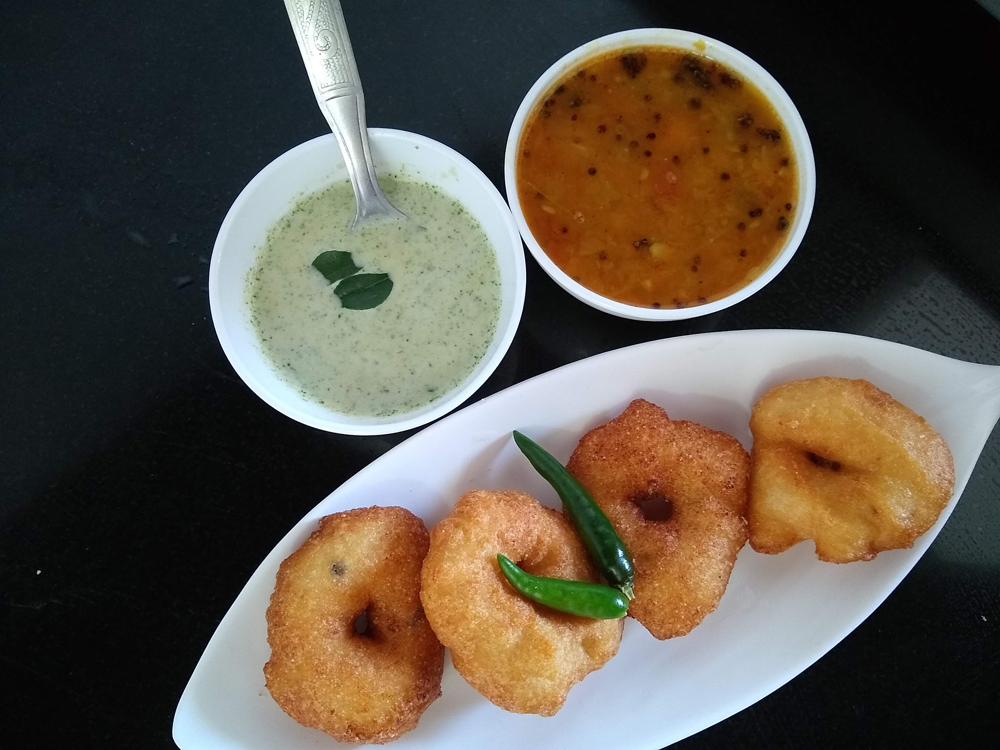

Medu Vada is a crispy, fluffy, savoury fried snack from India. There are different types of vadas which are made from different ingredients, ranging from Medu from (South India) to Batata Vada (Western India). Medu vada is a staple breakfast item of South India.

    

Medu Vada is a healthy and tasty breakfast option because it consists of lentils which are the richest source of Protein and Vitamin B. It is full of iron, folic acid, and calcium, magnesium and potassium.

The hole in the Medu vada is to make it cook uniformly along its layers and prevent the middle of the vada from swelling up more than the edges of the vada. The Hole in the middle of crispy golden vada makes it more attractive for consumers to consume it.

These Vadas are made by using white Urad Dal. The batter of this vada involves soaking and grinding of urad dal to a fine batter. Medu Vada are served as a breakfast item or as a snack with Hot Sambhar and peanuts or coconut chutneys. These Vadas are used in other dishes like Dahi vada.

Here is how to make this Medu Vada.

    

        <dl class="row">
            <dt class="col-sm-4">Cuisine</dt><dd class="col-sm-7">South Indian</dd>
            <dt class="col-sm-4">Course</dt><dd class="col-sm-7">Breakfast</dd>
            <dt class="col-sm-4">Diet</dt><dd class="col-sm-7">Vegetarian</dd>
            <dt class="col-sm-4">Equipments</dt><dd class="col-sm-7">Kadai (Wok) / Heavy Bottomed Pan</dd>
        </dl>
    

    

        <dl class="row">
            <dt class="col-sm-5">Prep. Time</dt><dd class="col-sm-7">1 hour 15 mins</dd>
            <dt class="col-sm-5">Cooking Time</dt><dd class="col-sm-7">15 mins</dd>
            <dt class="col-sm-5">Total Time</dt><dd class="col-sm-7">1 hour 30 mins</dd>
            <dt class="col-sm-5">Makes</dt><dd class="col-sm-7">2 Servings</dd>
        </dl>
    

<section>
    

    

        
<h5 class="font-weight-bold">Ingredients</h5>

    

    

        
            
            <ul style="line-height: 200%">
                <li>2 cups Urad Dal</li>
                <li>8-10 Black Peppercorns</li>
                <li>Salt to taste</li>
                <li>¼ tbsp Grated Ginger</li>
                <li>2 fine Chopped Green Chilies</li>
                <li>½ cup Rice Flour</li>
                <li>Oil For Frying</li>
            </ul>
        

    

</section>

        
<h5 class="font-weight-bold">Recipe Steps</h5>

    

    

        <ol class="text-justify" style="line-height: 200%">
            <li style="margin-bottom:5px;">Wash the urad dal 2-3 times with water and soaked this dal for 8-9 hours in water.</li>
            <li style="margin-bottom:5px;">After 8 hours grind the soaked urad dal by adding very little water. Now Pour this thick urad dal batter in a mixing Bowl.</li>
            <li style="margin-bottom:5px;">Add Rice flour, crushed Black peppercorns, Salt, Grated Ginger, Green chilies into an urad dal batter. Mix well. Rice flour is added to enhance the crispness of these vadas.</li>
            <li style="margin-bottom:5px;">Heat Oil in Kadhai.</li>
            <li style="margin-bottom:5px;">Take ½ cup water in a bowl and apply this water on the palm of your hand and then start making Vadas. Because of applying water on your palm, batter does not get stuck on your palm.</li>
            <li style="margin-bottom:5px;">Take a small portion from the batter in your hand and make a hole in it and fry it on low flame till the color of these vada becomes golden brown.</li>
            <li style="margin-bottom:5px;">Serve hot these Medu Vadas with Sambar and Peanut/Coconut Chutney.</li>
        </ol>
    

    

        

            <iframe width="560" height="315" src="https://www.youtube.com/embed/bMSZpeGJtd8" frameborder="0" allow="accelerometer; autoplay; encrypted-media; gyroscope; picture-in-picture" allowfullscreen></iframe>
        

    

 