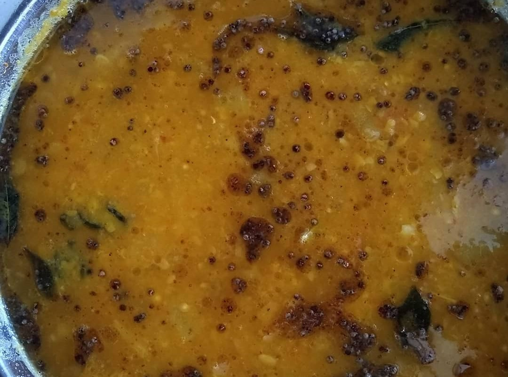

Sambhar is a famous South Indian dish, served with Idli, Vada, Rice etc. Sambar also called sambar is a lentil based vegetable stew cooked with Arhar / Toor Dal and tamarind pulp. This dish is popular in South Indian and Sri lankan Cuisines.

    

Sambhar is very healthy and nutritious as it is prepared using lentils and a variety of mixed vegetables. It is protein rich food loaded with many vitamins, minerals  and antioxidants thus making this recipe healthier. The vegetables used to make Sambhar are usually Drumstick,  Onion, eggplant, pumpkin, carrots, bottle gourd, Shallots, tomato and tamarind.

A basic Sambhar recipe is made by cooking vegetables and dal along with different spices especially Sambhar Powder which enhances the taste of sambhar, making it more delicious and yummy.

Sambhar was accidentally invented by a Maratha ruler Sambhaji, when he tried to make dal curry in the absence of his chef. He added tamarind to the dal, resulting in the dish that later came to be known as Sambhar.

Here is how to make this South Indian style Sambhar.

    

        <dl class="row">
            <dt class="col-sm-4">Cuisine</dt><dd class="col-sm-7">South Indian</dd>
            <dt class="col-sm-4">Course</dt><dd class="col-sm-7">Breakfast, Lunch and Dinner</dd>
            <dt class="col-sm-4">Diet</dt><dd class="col-sm-7">Vegetarian</dd>
            <dt class="col-sm-4">Equipments</dt><dd class="col-sm-7">Kadai (Wok) / Heavy Bottomed Pan</dd>
        </dl>
    

    

        <dl class="row">
            <dt class="col-sm-5">Prep. Time</dt><dd class="col-sm-7">20 mins</dd>
            <dt class="col-sm-5">Cooking Time</dt><dd class="col-sm-7">20 mins</dd>
            <dt class="col-sm-5">Total Time</dt><dd class="col-sm-7">40 mins</dd>
            <dt class="col-sm-5">Makes</dt><dd class="col-sm-7">2 Servings</dd>
        </dl>
    

<section>
    

    

        
<h5 class="font-weight-bold">Ingredients</h5>

    

    

        
            
            <ul style="line-height: 200%">
                <li>1½ cup Arhar Dal / Toor Dal</li>
                <li>2 Drumsticks (Sehjan ki phali)</li>
                <li>2 Fine Chopped Tomato</li>
                <li>1 medium size chopped Onion</li>
                <li>2  chopped Carrots</li>
                <li>2 chopped small Brinjal</li>
                <li>½ cup chopped Bottle Gourd</li>
                <li>¼ cup  Tamarind Pulp (Optional)</li>
                <li>Mustard seeds</li>
                <li>Curry Leaves</li><li>4-5 Red chillies</li>
                <li>oil for tadka</li>
                <li>¼ tsp Turmeric powder</li>
                <li>¼ tsp Red Chili Powder</li>
                <li>¼ tsp Sambar Powder</li>
                <li>¼ tsp Rasam Powder</li>
                <li>¼ tsp Hing</li>
                <li>Salt To taste</li>
            </ul>
        

    

</section>

        
<h5 class="font-weight-bold">Recipe Steps</h5>

    

    

        

            Sambhar can be prepared in two ways :- 
            &bull; By boiling Toor dal along with a variety of vegetables and  different powdered spices and then make a tadka of Mustard seeds, hing, curry leaves and red chilies. 
            &bull; Or, by shallow frying all the vegetables in oil in a pressure cooker and then add soaked toor dal and various spices and then cook till two whistles. 
            In this Recipe , I will show you the recipe of Sambhar according to the second method.
        

        <ol class="text-justify" style="line-height: 200%">
            <li style="margin-bottom:5px;">Heat 3 tsp oil in a cooker and add chopped Onion in it and cook it till its color changes to golden pink.</li>
<li style="margin-bottom:5px;">Now add chopped carrots, chopped Tamarind pulp  in the cooker and cook these for 2-3 minutes on low to medium flame.</li>
<li style="margin-bottom:5px;">Now add chopped brinjal , chopped Bottle gourd, chopped Tomato in the cooker. Mix all the vegetables and cook it for 3-4 minutes with the lid open on low flame.</li>
<li style="margin-bottom:5px;">Add washed toor dal in the cooker and mix well.Now add different powdered spices like turmeric powder, Red chilli powder, salt , sambar powder and rasam powder. Mix well. Tip:-  Add Sambhar or Rasam powder in this proportion. 
                Add ¼ tsp Sambar Powder + ¼ tbsp Rasam Powder 
                Or 
                Add ½ tsp Sambar Powder 
                Or 
                Add ½ tbsp Rasam Powder</li>
<li style="margin-bottom:5px;">Add 2  cups of water and close the lid of the cooker and cook it till 2-3 whistles on low flame. After three Whistles Sambhar is ready. Now Roughly Mash this sambar with the hand blender.</li>
<li style="margin-bottom:5px;">Now make a  tadka , heat 3 tbsp of Oil in a tadka pan and add Mustard seeds, hing, Red chilies, curry leaves and very little split Urad Dal in oil.</li>
<li style="margin-bottom:5px;">Now add this tadka in  sambhar.</li>
<li style="margin-bottom:5px;">Serve Hot sambhar with Vadas, Idly  and spicy  coconut/Peanuts chutney.</li>
        </ol>
        

            <i class="fas fa-lightbulb"></i> In case Sambhar is coming out as a bit runny, balance the consistency by adding a few spoons of rice flour and water mixture into the Sambhar to thicken it.
             
            <i class="fas fa-lightbulb"></i> If your sambhar becomes more tangy then you can reduce the tanginess by adding a small piece of jaggery in Sambhar while cooking.
        

    

    

        

            <iframe width="560" height="315" src="https://www.youtube.com/embed/3_vj2JcpUm4" frameborder="0" allow="accelerometer; autoplay; encrypted-media; gyroscope; picture-in-picture" allowfullscreen></iframe>
        

    

 