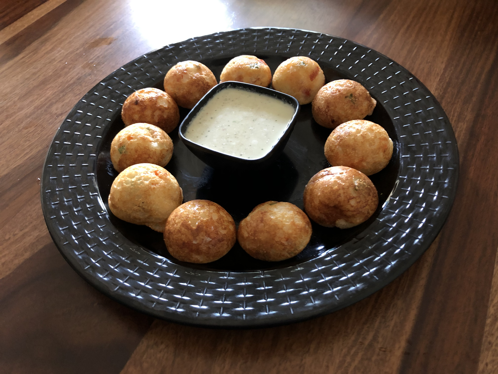

Suji ke Appe is a very easy to make and healthy breakfast recipe. It is originated in South India but now popular in whole of India. Instant Suji ke appe is a very good option when you are in a hurry, and at the same time, want a wholesome and healthy breakfast to eat, then you should try this crispy instant Suji ke appe. It is a quick, healthy, and tasty breakfast served with Peanuts or Coconut Chutney.

    

Appe can also be made by fermenting rice and urad dal batter, the same batter which is used to make Idli. In this Recipe Semolina is mixed with Curd, Eno (Yes Eno ☺) and a variety of vegetables like onion, beans, carrots, tomato, green peas, green chilies, and capsicum.

Here is how to make this Suji ke Appe.

    

        <dl class="row">
            <dt class="col-sm-4">Cuisine</dt><dd class="col-sm-7">South Indian</dd>
            <dt class="col-sm-4">Course</dt><dd class="col-sm-7">Breakfast</dd>
            <dt class="col-sm-4">Diet</dt><dd class="col-sm-7">Vegetarian</dd>
            <dt class="col-sm-4">Equipments</dt><dd class="col-sm-7">Appam Pan / Mixing Bowl</dd>
        </dl>
    

    

        <dl class="row">
            <dt class="col-sm-5">Prep. Time</dt><dd class="col-sm-7">10 mins</dd>
            <dt class="col-sm-5">Cooking Time</dt><dd class="col-sm-7">8 mins</dd>
            <dt class="col-sm-5">Total Time</dt><dd class="col-sm-7">18 mins</dd>
            <dt class="col-sm-5">Makes</dt><dd class="col-sm-7">2 Servings</dd>
        </dl>
    

    
<h5 class="font-weight-bold">Ingredients</h5>

    

        <ul class="post-list" style="line-height: 200%">
            <li>2 cups Suji / Semolina</li>
            <li>250 gm Curd</li>
            <li>1 fine chopped Tomato</li>
            <li>1 fine chopped Capsicum</li>
            <li>2 Fine chopped Carrots</li>
            <li>French beans (2-3)</li>
            <li>1 boiled Mashed Potato</li>
            <li>½ cup Green Peas</li>
            <li>2-3 fine chopped Green Chillies</li>
            <li>1 fine chopped Onion</li>
            <li>chopped coriander leaves</li>
            <li>1 tsp Eno</li>
            <li>Salt to Taste</li>
            <li>½ tbsp Mustard seeds</li>
            <li>Curry leaves</li>
        </ul>
    

    
<h5 class="font-weight-bold">Recipe Steps</h5>

    

        <ol class="post-list text-justify" style="line-height: 200%">
            <li style="margin-bottom:5px;">Take a large mixing bowl. In that bowl add Suji, tomato, Green Peas, mashed potato, carrots, beans, capsicum, coriander leaves, salt and eno.</li>
            <li style="margin-bottom:5px;">Mix Well. Cover the bowl with a plate and keep it aside.</li>
            <li style="margin-bottom:5px;">Heat the Appam / Appe pan and apply oil in each circular mould in that pan with the help of an oil brush.</li>
            <li style="margin-bottom:5px;">Add less than a pinch of mustard seeds and chopped curry leaves in each mould, and then add Suji mixture in each mould and cover the appe pan with its lid and let it cook for 4–5 minutes.</li>
            <li style="margin-bottom:5px;">After five minutes, open the lid and flip each appam and cook these appe from other side on medium flame for another two minutes.</li>
            <li style="margin-bottom:5px;">Transfer these Crispy Suji Ke appe from pan to plate and serve them with coconut chutney or Peanut Chutney.</li>
        </ol>
    

 
