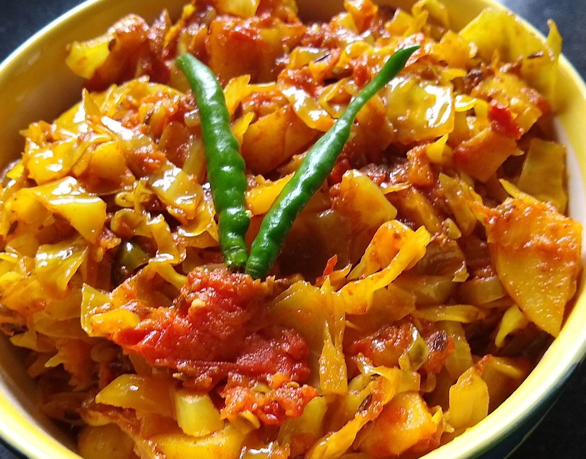

Aloo Patta Gobhi sabji is the healthy and tasty sabji, prepared in a very simple manner. This vegetarian Sabji acts as a side dish in any vegetarian thali in India.

    

This sabji requires very less spices and oil to cook. This sabji is mainly eaten with Roti, Paratha and Dal Rice. Cabbage and Potato are two main ingredients used to prepare this sabji. These two ingredients are rich in fibre, minerals and antioxidants, thus making this Sabji very nutritious and healthy to eat.

Here is how to make this Aloo Patta Gobhi ki sookhi Sabji.

    

        <dl class="row">
            <dt class="col-sm-4">Cuisine</dt><dd class="col-sm-7">North Indian</dd>
            <dt class="col-sm-4">Course</dt><dd class="col-sm-7">Lunch and Dinner</dd>
            <dt class="col-sm-4">Diet</dt><dd class="col-sm-7">Vegetarian</dd>
            <dt class="col-sm-4">Equipments</dt><dd class="col-sm-7">Kadai (Wok) / Pressure Cooker</dd>
        </dl>
    

    

        <dl class="row">
            <dt class="col-sm-5">Prep. Time</dt><dd class="col-sm-7">10 mins</dd>
            <dt class="col-sm-5">Cooking Time</dt><dd class="col-sm-7">20 mins</dd>
            <dt class="col-sm-5">Total Time</dt><dd class="col-sm-7">30 mins</dd>
            <dt class="col-sm-5">Makes</dt><dd class="col-sm-7">2 Servings</dd>
        </dl>
    

    
<h5 class="font-weight-bold">Ingredients</h5>

    

        <ul class="post-list" style="line-height: 200%">
            <li>Chopped Cabbage</li>
            <li>2 chopped Potato in cubes</li>
            <li>2 Onions</li>
            <li>3-4 Green Chilli</li>
            <li>4-5 cloves of Garlic</li>
            <li>½ inch Ginger</li>
            <li>2 tomatoes</li>
            <li>¼ tbsp Cumin seeds/Jeera</li>
            <li>¼ tbsp Turmeric Powder</li>
            <li>½ tbsp Red chili Powder</li>
            <li>½ tbsp Coriander Powder</li>
            <li>salt to taste</li>
            <li>Sabji Masala</li>
            <li>Pinch of Meethi Dana</li>
            <li>Pinch of Hing</li>
            <li>Mustard Oil for Cooking</li>
            <li>Chopped Coriander Leaves</li>
        </ul>
    

    
<h5 class="font-weight-bold">Recipe Steps for Method 1</h5>

    

        <ol class="post-list text-justify" style="line-height: 200%">
            <li style="margin-bottom:5px;">Prepare fine paste of Ginger, Garlic and Green chilies in a mixer and keep it aside.</li>
            <li style="margin-bottom:5px;">Prepare puree of two tomatoes and keep it aside in a bowl.</li>
            <li style="margin-bottom:5px;">Finely chop pieces of Cabbage and Onions.</li>
            <li style="margin-bottom:5px;">Heat the kadhai and add mustard oil in it. Then add Hing, Cumin Seeds, Meethi dana to heated oil. Let Jeera splutter in the oil. Now add fine chopped onions to it and cook on low flame till the color of onions change to shiny pink.</li>
            <li style="margin-bottom:5px;">Now add Ginger, Garlic and Green chilies paste in the kadhai and cook it well.</li>
            <li style="margin-bottom:5px;">Add Tomato puree to the mixture in the kadhai and cook this masala till the oil separates.</li>
            <li style="margin-bottom:5px;">Now add Turmeric powder, Red chili powder, coriander powder, salt to the masala and cook these powdered spices well.</li>
            <li style="margin-bottom:5px;">Now add chopped Cabbage and Potato pieces in the masala.</li>
            <li style="margin-bottom:5px;">Mix it well.</li>
            <li style="margin-bottom:5px;">Cover lid of the kadhai and let the sabji cook for 10 minutes on low flame. Add Sabji masala to the aloo patta gobhi sabji.</li>
            <li style="margin-bottom:5px;">After 10 minutes, transfer the cooked sabji into the bowl and garnish with chopped coriander leaves.</li>
        </ol>
    

    
<h5 class="font-weight-bold">Recipe Steps for Method 2</h5>

    

        <ol class="post-list text-justify" style="line-height: 200%">
            <li style="margin-bottom:5px;">Pour Mustard oil in the  Pressure cooker.</li>
            <li style="margin-bottom:5px;">Add a pinch of hing and methi dana to the oil.</li>
            <li style="margin-bottom:5px;">Now add  tomato puree to the oil and cook this on low flames till the oil separates.</li>
            <li style="margin-bottom:5px;">Add all the powdered spices that are turmeric powder, red chili powder, coriander powder and salt to the Tomato puree and mix it well. Cook the whole masala for 5-6 minutes on low flame.</li>
            <li style="margin-bottom:5px;">Now add chopped cabbage and potato pieces to the masala and mix it well.</li>
            <li style="margin-bottom:5px;">Cover the lid of the cooker and cook it till 2 whistle.</li>
            <li style="margin-bottom:5px;">After sabji is pressure cooked add sabji masala and chopped coriander leaves to the sabji.</li>
            <li style="margin-bottom:5px;">Serve hot with Roti or Paratha ,Rice and Dal tadka.</li>
        </ol>
    

 
