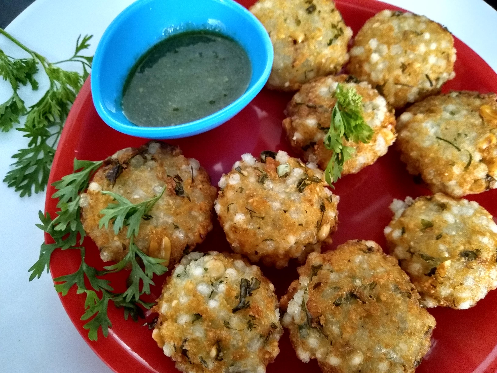

Sabudana Vada is a popular Maharashtrian snack, often served with spicy green chutney and hot chai. It is a crisp fried snack made up of sabudana or Sago (Tapioca pearls), Peanuts, Potatoes and herbs.

    

Sabudana Vada is an excellent option when you are fasting. In India this filling and nutritious snack is usually served during religious festivals and during fast/ vrat / upvas especially during Navratri vrats. As per Hindu beliefs food that is taken during the fast should not contain Onions, garlic, pulses, or wheat flour. Like all Vada these are best eaten fresh.

These Sabudana Vadas are crisp from outside and soft from inside. In my family everyone enjoys eating Sabudana Vada.

Here is how to make this Sabudana Vada.

    

        <dl class="row">
            <dt class="col-sm-4">Cuisine</dt><dd class="col-sm-7">North Indian</dd>
            <dt class="col-sm-4">Course</dt><dd class="col-sm-7">Snack</dd>
            <dt class="col-sm-4">Diet</dt><dd class="col-sm-7">Vegetarian</dd>
            <dt class="col-sm-4">Equipments</dt><dd class="col-sm-7">Kadai (Wok) / Heavy Bottomed Pan</dd>
        </dl>
    

    

        <dl class="row">
            <dt class="col-sm-5">Prep. Time</dt><dd class="col-sm-7">15 mins</dd>
            <dt class="col-sm-5">Cooking Time</dt><dd class="col-sm-7">15 mins</dd>
            <dt class="col-sm-5">Total Time</dt><dd class="col-sm-7">30 mins</dd>
            <dt class="col-sm-5">Makes</dt><dd class="col-sm-7">2 Servings</dd>
        </dl>
    

    
<h5 class="font-weight-bold">Ingredients</h5>

    

        <ul class="post-list" style="line-height: 200%">
            <li>1 cup Sabudana (water soaked)</li>
            <li>Dry Roasted Peanuts</li>
            <li>1 boiled Potato</li>
            <li>Chopped Green Chillies</li>
            <li>Chopped Coriander leaves</li>
            <li>Salt to taste</li>
            <li>1 tbsp Cumin Seeds ( Jeera )</li>
            <li>1 tbsp Corn Flour</li>
            <li>Oil for frying</li>
        </ul>
    

    
<h5 class="font-weight-bold">Recipe Steps</h5>

    

        <ol class="post-list text-justify" style="line-height: 200%">
            <li style="margin-bottom:5px;">Heat the pan and dry roast the Peanuts. After roasting remove the skin of peanuts and grind it coarsely.</li>
            <li style="margin-bottom:5px;">Take a mixing bowl and grate boiled Potatoes in it. Now add water-soaked sabudana, salt, chopped coriander leaves, chopped green chili, cumin seeds, Peanuts powder, Corn flour to it.</li>
            <li style="margin-bottom:5px;">Mix well.</li>
            <li style="margin-bottom:5px;">Grease your palm with vegetable oil and start making small circular vadas using that mixture. Keep these vadas aside on a plate.</li>
            <li style="margin-bottom:5px;">Heat oil in kadhai.</li>
            <li style="margin-bottom:5px;">Fry the Vadas till it becomes crisp golden brown in color.</li>
            <li style="margin-bottom:5px;">Serve hot with Spicy Green Chutney and Hot Tea.</li>
        </ol>
    

    

        

            <iframe width="100%" height="315" src="https://www.youtube.com/embed/UBO-urwwCZk" frameborder="0" allow="accelerometer; autoplay; encrypted-media; gyroscope; picture-in-picture" allowfullscreen></iframe>
        

    

 
