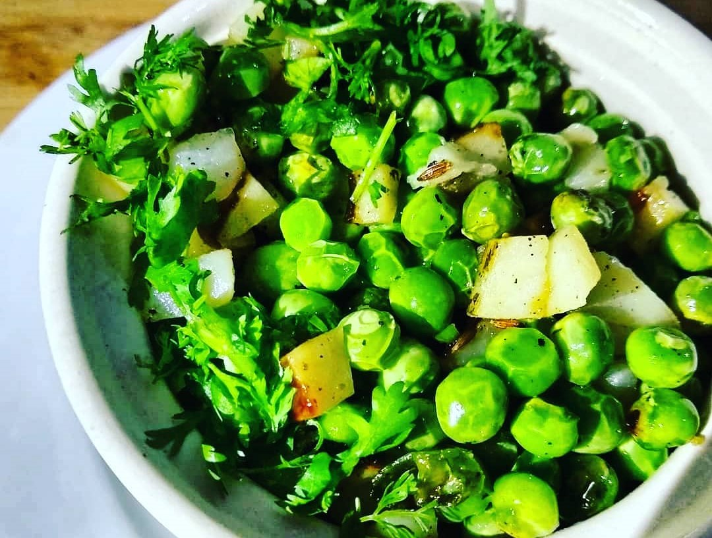

Green Peas are little pellets of nutrients. They may look small, but are loaded with nutrients and minerals. Even though there are spices used in this recipe, they can be kept at a minimum to actually let the peas shine through.

    

A dish widely prepared in Uttar Pradesh, this traditional UP style Matar Ki Ghugri is made using peas and just a few spices. Make it with the most tender winter peas while they are in season. The dish is liked by all my family members. The recipe is very simple, easy to make, delicious.

Here is how to make this Matar ki Ghughri / Ghugni

    

        <dl class="row">
            <dt class="col-sm-4">Cuisine</dt><dd class="col-sm-7">North Indian (Awadhi)</dd>
            <dt class="col-sm-4">Course</dt><dd class="col-sm-7">Breakfast</dd>
            <dt class="col-sm-4">Diet</dt><dd class="col-sm-7">Vegetarian</dd>
            <dt class="col-sm-4">Equipments</dt><dd class="col-sm-7">Kadai (Wok) / Heavy Bottomed Pan</dd>
        </dl>
    

    

        <dl class="row">
            <dt class="col-sm-5">Prep. Time</dt><dd class="col-sm-7">15 mins</dd>
            <dt class="col-sm-5">Cooking Time</dt><dd class="col-sm-7">15 mins</dd>
            <dt class="col-sm-5">Total Time</dt><dd class="col-sm-7">30 mins</dd>
            <dt class="col-sm-5">Makes</dt><dd class="col-sm-7">2 Servings</dd>
        </dl>
    

    
<h5 class="font-weight-bold">Ingredients</h5>

    

        <ul class="post-list" style="line-height: 200%">
            <li>3 cup Green Peas</li>
            <li>Cooking oil</li>
            <li>1 tbsp Green Chillies, finely chopped</li>
            <li>1 potato cut in small fine cubes</li>
            <li>Chopped Coriander (Dhania) Leaves</li>
            <li>Chopped Green Chillies</li>
            <li>2-3 clove chopped Garlic</li>
            <li>1 tbsp Cumin Seeds (Jeera)</li>
            <li>Hing (pinch)</li>
        </ul>
    

    
<h5 class="font-weight-bold">Recipe Steps</h5>

    

        <ol class="post-list text-justify" style="line-height: 200%">
            <li style="margin-bottom:5px;">Heat 3 tbsp oil in kadhai. Add Hing, Cumin seeds, Chopped Garlic, Chopped Green Chili, to a kadhai. Mix well.</li>
            <li style="margin-bottom:5px;">Now add Green Peas and Potato cubes to the kadhai. Mix well. Cover the kadhai lid and cook this for 7-8 minutes on low flame.</li>
            <li style="margin-bottom:5px;">After 7-8 minutes Matar ki Ghughri is ready.</li>
            <li style="margin-bottom:5px;">Garnish this with chopped coriander leaves and lemon slices.</li>
            <li style="margin-bottom:5px;">Serve hot with Hot tea.</li>
        </ol>
    

    

        

            <iframe width="100%" height="315" src="https://www.youtube.com/embed/aNnU82AL2B4" frameborder="0" allow="accelerometer; autoplay; encrypted-media; gyroscope; picture-in-picture" allowfullscreen></iframe>
        

    

 
