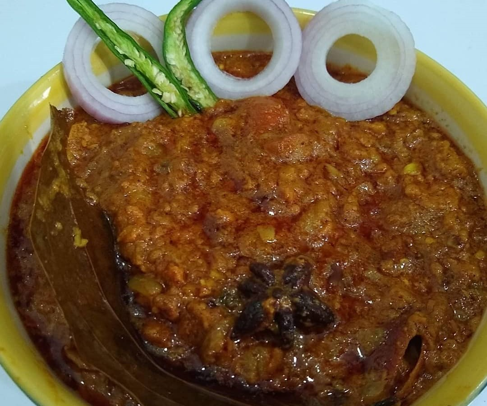

Mutton Keema is considered one of the easy, healthy and delicious non-vegetarian dishes in India. It is a very popular dish in North India which you can prepare at your home in a very convenient way as ingredients used in this dish are easily available.

    

Mutton keema is a favourite among all non-vegetarians. This dish is prepared using minced meat and a variety of aromatic spices  which makes this dish more flavourful and tasty.

Lucknow is famous for its non-vegetarian delicacies, some of which are quite simple to make and some can be quite complex. Mutton keema is a perfect blend of different aromatic spices and tender juicy meat.

Mutton keema is usually served hot with Rumali Roti or Naan or tandoori Roti and Jeera Rice. The more we roast (bhuno) the minced meat and spices (roasting of masala), the more delicious keema will come out. Slow Cooked Mutton always tastes more delicious and yummy.

Here is how to make this Mutton Keema

    

        <dl class="row">
            <dt class="col-sm-4">Cuisine</dt><dd class="col-sm-7">North Indian</dd>
            <dt class="col-sm-4">Course</dt><dd class="col-sm-7">Lunch And Dinner</dd>
            <dt class="col-sm-4">Diet</dt><dd class="col-sm-7">Non-Vegetarian</dd>
            <dt class="col-sm-4">Equipments</dt><dd class="col-sm-7">Kadai (Wok)</dd>
        </dl>
    

    

        <dl class="row">
            <dt class="col-sm-5">Prep. Time</dt><dd class="col-sm-7">30 mins</dd>
            <dt class="col-sm-5">Cooking Time</dt><dd class="col-sm-7">40 mins</dd>
            <dt class="col-sm-5">Total Time</dt><dd class="col-sm-7">1 hour 10 mins</dd>
            <dt class="col-sm-5">Makes</dt><dd class="col-sm-7">2 Servings</dd>
        </dl>
    

    
<h5 class="font-weight-bold">Ingredients</h5>

    

        <ul class="post-list" style="line-height: 200%">
            <li>500 gm Mutton</li>
            <li>4-5 Cloves of Garlic</li>
            <li>1 inch Ginger</li>
            <li>3-4 Green Chili</li>
            <li>½ cup cashew nuts</li>
            <li>1 Tomato</li>
            <li>2 Medium Size Chopped Onion</li>
            <li>4 tbsp Mustard Oil</li>
            <li>Chopped Coriander Leaves</li>
            <li>Salt to taste</li>
            <li>Dry Spices</li>
            <ul>
                <li>1 Tejpatta</li>
                <li>½ inch Dalchini</li>
                <li>Javitri (little)</li>
                <li>Pinch of Nutmeg</li>
                <li>2-3 clove/ laung</li>
                <li>9-10 Blackpeppercons</li>
                <li>1 Badi Elachi /Big Cardamoms</li>
                <li>2 Choti Elaichi/ Small Cardamom</li>
                <li>Star Anise (small piece)</li>
            </ul>
            <li>Powdered spices</li>
            <ul>
                <li>¼ tbsp Cumin seeds / Jeera</li>
                <li>½ tbsp Coriander powder</li>
                <li>½ tbsp Red chili powder</li>
                <li>¼ tbsp Turmeric Powder</li>
                <li>¼ tbsp Mutton Masala</li>
            </ul>
        </ul>
    

    
<h5 class="font-weight-bold">Recipe Steps</h5>

    

        <ol class="post-list text-justify" style="line-height: 200%">
            <li style="margin-bottom:5px;">Make a fine paste of Ginger, Garlic, and Green chilies and keep it aside.</li>
            <li style="margin-bottom:5px;">Soak cashew nuts in water for one hour. After 1 hour make a fine paste of cashew nuts and keep it aside in a bowl.</li>
            <li style="margin-bottom:5px;">Pour Mustard oil in a kadhai and heat up the oil. Add Tejpatta to the oil.</li>
            <li style="margin-bottom:5px;">Then add all solid dry spices to the oil like star anise, cardamom, black peppercorns, cloves, Dalchini,  Javitri. Cook these spices carefully as they burn easily and spoil the taste and texture of gravy.</li>
            <li style="margin-bottom:5px;">Now add Chopped onions in the kadhai and cook this until the color of onion changes to shiny pinkish brown.</li>
            <li style="margin-bottom:5px;">Now add minced mutton in the kadhai and mix well with the onions and cook this mixture for 7-8 minutes with the lid covered.</li>
            <li style="margin-bottom:5px;">After 8 minutes add Ginger, Garlic, Green chilli paste in the kadhai and cook these mixture very well until the raw smell of Garlic goes away.</li>
            <li style="margin-bottom:5px;">Now add chopped tomato in the kadhai and mix it well with the masala. Now add all the dry spices like turmeric powder, Red chili powder, coriander powder, kashmiri lal mirch powder and salt to the masala and cook(bhuno) the masala on low flame for 5-6 minutes.</li>
            <li style="margin-bottom:5px;">Do Not add any water at this point as juices from minced meat is sufficient enough to cook the mixture. Cover the lid of the kadhai and cook the mixture for 10 minutes.</li>
            <li style="margin-bottom:5px;">After 10 minutes, add cashew nut mixture in the kadhai and mix it well with the masala. Now add two slit green chilies into the masala and cook these masala for another 7-8 minutes with the lid covered.</li>
            <li style="margin-bottom:5px;">After 8 minutes, open the lid and add a little water and again bhuno(Cook) this  mixture very well so that masala doesn't get burned.</li>
            <li style="margin-bottom:5px;">Now Mutton keema is ready.</li>
            <li style="margin-bottom:5px;">Garnish this Mutton Keema with Chopped Coriander leaves.</li>
            <li style="margin-bottom:5px;">Serve Hot Mutton Curry with hot Rumali Roti, butter garlic Naan and Jeera Rice.</li>
        </ol>
    

    

        

            <iframe width="100%" height="315" src="https://www.youtube.com/embed/HZsZqYDmqKc" frameborder="0" allow="accelerometer; autoplay; encrypted-media; gyroscope; picture-in-picture" allowfullscreen></iframe>
        

    

 
