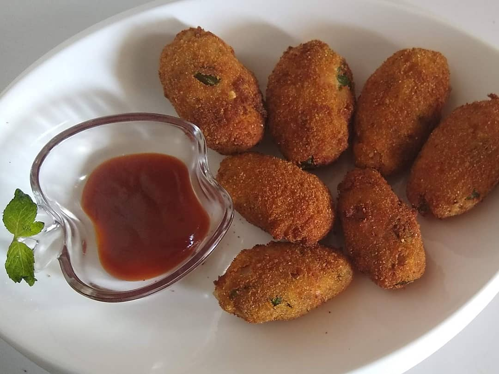

Poha cutlet is a mouthwatering snack option for food lovers who want to try something new on their taste palate. Poha Cutlets are a popular snack on any Indian restaurant menu. It is very simple, healthy, easy to make and can be served for an evening snack with green chutney or Tomato  ketchup. A schezwan sauce or mayonnaise dip goes best with these.

    

These cutlets can be deep fried or baked or shallow fried depending on one’s taste buds and health factors. It is a favourite tea time breakfast snack made with a combination of Potato, Poha (Chiwda) and many more ingredients.

Great option for those moms who are in a hurry and unannounced guests arrive  ..... and you are racking your brains to come up with a quick and easy option???

No Worry !!! Make these Poha cutlets...Simple and easy to make with a burst of flavour inside. These cutlets are also a very good option for kids' lunchboxes.

Here is how to make this Poha Cutlet

    

        <dl class="row">
            <dt class="col-sm-4">Cuisine</dt><dd class="col-sm-7">North Indian Starter</dd>
            <dt class="col-sm-4">Course</dt><dd class="col-sm-7">Breakfast and Evening Snacks</dd>
            <dt class="col-sm-4">Diet</dt><dd class="col-sm-7">Vegetarian</dd>
            <dt class="col-sm-4">Equipments</dt><dd class="col-sm-7">Kadai (Wok) / Heavy Bottomed Pan</dd>
        </dl>
    

    

        <dl class="row">
            <dt class="col-sm-5">Prep. Time</dt><dd class="col-sm-7">20 mins</dd>
            <dt class="col-sm-5">Cooking Time</dt><dd class="col-sm-7">20 mins</dd>
            <dt class="col-sm-5">Total Time</dt><dd class="col-sm-7">40 mins</dd>
            <dt class="col-sm-5">Makes</dt><dd class="col-sm-7">2 Servings</dd>
        </dl>
    

    
<h5 class="font-weight-bold">Ingredients</h5>

    

        <ul class="post-list" style="line-height: 200%">
            <li>1 Egg</li>
            <li>1/4 cup Poha</li>
            <li>1/3 cup Chopped Onion</li>
            <li>1 cup grated boiled Potatoes</li>
            <li>2 green chillies</li>
            <li>1/4 tsp Amchur Powder</li>
            <li>1/4 tsp Garam Masala Powder</li>
            <li>1/4 tsp Red Chilli Powder</li>
            <li>2 tsp Bread crumbs</li>
            <li>Chopped Coriander leaves</li>
            <li>Salt to Taste</li>
            <li>Oil for frying</li>
        </ul>
    

    
<h5 class="font-weight-bold">Recipe Steps</h5>

    

        <ol class="post-list text-justify" style="line-height: 200%">
            <li style="margin-bottom:5px;">Break the egg and keep it in a bowl. Add salt as per taste to the egg and beat it. This is Bowl no. 1.</li>
            <li style="margin-bottom:5px;">Place bread crumbs in another bowl. This is Bowl no. 2.</li>
            <li style="margin-bottom:5px;">Wash 1/4 cup Poha with water and keep it aside.</li>
            <li style="margin-bottom:5px;">Grate Boiled Potatoes in another mixing bowl (Bowl no.3). Add chopped Onion, water-soaked poha, chopped coriander leaves, Amchur powder, Red chilli powder, Garam masala powder, chopped Green Chilli, and salt according to taste.</li>
            <li style="margin-bottom:5px;">Mash the mixture.</li>
            <li style="margin-bottom:5px;">Grease your palm with vegetable oil and start making small cylindrical shape cutlets and keep it aside on a plate. Make sure all your cutlets are of the same size and shape.</li>
            <li style="margin-bottom:5px;">Now roll  these cutlets in the egg mix (Bowl no. 1 ) first and then in bread crumbs (Bowl no. 2) so that bread crumbs are easily stuck to these cutlets due to egg coating.</li>
            <li style="margin-bottom:5px;">Heat oil in a kadhai for frying these cutlets.</li>
            <li style="margin-bottom:5px;">Fry these cutlets on medium flame till its color becomes golden brown.</li>
            <li style="margin-bottom:5px;">Serve hot with Green Pudina chutney or tomato ketchup.</li>
        </ol>
    

    

        

            <iframe width="100%" height="315" src="https://www.youtube.com/embed/CdPZ4jOXO94" frameborder="0" allow="accelerometer; autoplay; encrypted-media; gyroscope; picture-in-picture" allowfullscreen></iframe>
        

    

 
