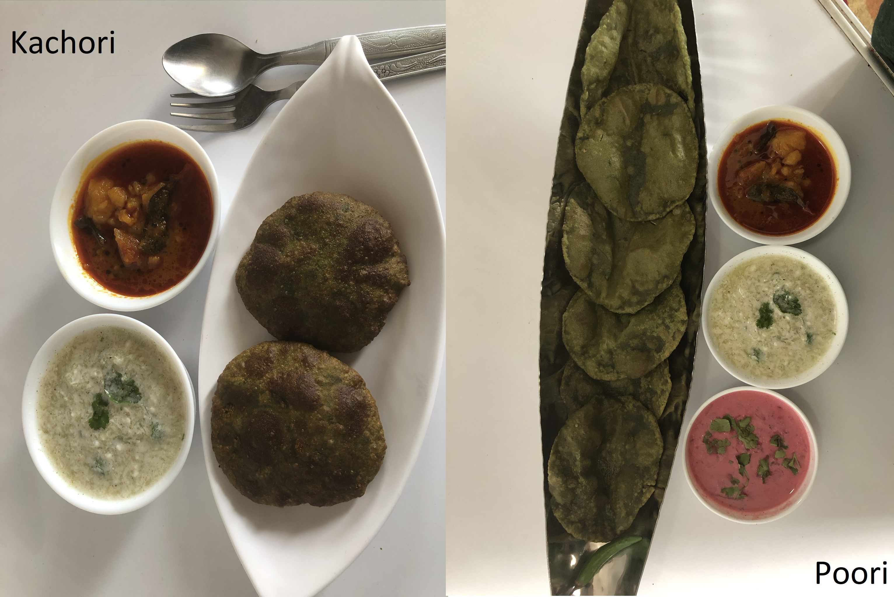

Bathua is a leaf vegetable which is cultivated in limited areas across the world. But India is considered to be the largest cultivator of Bathua. Rajasthan and Himachal Pradesh are two states where Bathua is grown in abundance.

    

Bathua leaves are also called Chenopodium Album. It is a fast growing weedy annual plant. In India these leaves are found abundantly in winters. Bathua leaves are full of nutrients and minerals, amino acids and antioxidants. It is a powerhouse of Vitamin A, B, C. There are many health benefits of eating Bathua, so eating any dishes cooked with Bathua will have a good impact on your health. We can make paratha, Poori, Raita and Saag using Bathua leaves.

We are going to look at two recipes of Bathua namely Bathua Poori and Aloo Bathua Kachori. Some of the steps for making these two dishes are common, I have highlighted where steps are different for Bathua Poori and Aloo Bathua Kachori.

Here is how to make this Bathua Poori and Aloo Bathua Kachori

    

        <dl class="row">
            <dt class="col-sm-4">Cuisine</dt><dd class="col-sm-7">North Indian</dd>
            <dt class="col-sm-4">Course</dt><dd class="col-sm-7">Breakfast, Lunch and Dinner</dd>
            <dt class="col-sm-4">Diet</dt><dd class="col-sm-7">Vegetarian</dd>
            <dt class="col-sm-4">Equipments</dt><dd class="col-sm-7">Kadai (Wok) / Heavy Bottomed Pan</dd>
        </dl>
    

    

        <dl class="row">
            <dt class="col-sm-5">Prep. Time</dt><dd class="col-sm-7">25 mins</dd>
            <dt class="col-sm-5">Cooking Time</dt><dd class="col-sm-7">15 mins</dd>
            <dt class="col-sm-5">Total Time</dt><dd class="col-sm-7">40 mins</dd>
            <dt class="col-sm-5">Makes</dt><dd class="col-sm-7">2 Servings</dd>
        </dl>
    

    
<h5 class="font-weight-bold">Ingredients</h5>

    

        <ul class="post-list" style="line-height: 200%">
            <li>250 gm Washed Bathua Leaves</li>
            <li>2 Boiled Potatoes</li>
            <li>Chopped Coriander Leaves</li>
            <li>2-3 Chopped Green Chili</li>
            <li>1 cup Wheat Flour (Atta)</li>
            <li>¼ tbsp Grated Ginger</li>
            <li>2-3 tbsp oil for giving Moyan</li>
            <li>¼ tbsp Chaat Masala</li>
            <li>½ tbsp Jeera</li>
            <li>Oil for Frying</li>
        </ul>
    

    
<h5 class="font-weight-bold">Recipe Steps</h5>

    

        <ol class="post-list text-justify" style="line-height: 200%">
            <li style="margin-bottom:5px;">Clean the Bathua leaves and wash them.</li>
            <li style="margin-bottom:5px;">Pressure cook Bathua leaves soaked with one cup of water till one whistle.</li>
            <li style="margin-bottom:5px;">After one whistle, strain all the boiled water and keep boiled bathua leaves in a bowl. Do not throw away the boiled water and keep it aside in a bowl.</li>
            <li style="margin-bottom:5px;">Grind boiled Bathua leaves into a smooth fine paste and keep it aside in a bowl.</li>
            <li style="margin-bottom:5px;">Take a big mixing bowl. Add wheat flour, grated Ginger, a little bit of oil (for moyan) and salt in it. Prepare a dough from this mixture. Keep this dough aside in a bowl.</li>
            <li style="margin-bottom:5px;">Heat oil in a kadhai.</li>
        </ol>
        <h6 class="font-weight-bold">Bathua Poori</h6>
        <ol class="post-list text-justify" style="line-height: 200%">
            <li style="margin-bottom:5px;">Make small balls from the dough and keep them in a plate.</li>
            <li style="margin-bottom:5px;">Now roll these dough on Chakla (Working Surface) into small circular shaped Poori.</li>
            <li style="margin-bottom:5px;">Fry this Poori in hot oil, cooking both sides. Bathua Poori is ready.</li>
            <li style="margin-bottom:5px;">Serve Bathua Poori with any spicy Potato curry and Cucumber Raita.</li>
        </ol>
        <h6 class="font-weight-bold">Aloo Bathua Kachori</h6>
        <ol class="post-list text-justify" style="line-height: 200%">
            <li style="margin-bottom:5px;">Make small balls from the dough and keep them in a plate.</li>
            <li style="margin-bottom:5px;">Take another Mixing Bowl and add grated potatoes, fine chopped chilies, fine chopped coriander leaves, chaat masala and salt in it. Mix well. This is the stuffed mixture for our Aloo Bathua Kachori.</li>
            <li style="margin-bottom:5px;">Stuff these balls with this potato mixture and keep it aside.</li>
            <li style="margin-bottom:5px;">Now carefully roll down these stuffed balls on chakla and fry it on low flame on both sides.</li>
            <li style="margin-bottom:5px;">Serve this hot Aloo bathua kachori with Aachar or Raita or any spicy Curry.</li>
        </ol>
    

    

        

            <iframe width="100%" height="315" src="https://www.youtube.com/embed/iRNB73Jf0Do" frameborder="0" allow="accelerometer; autoplay; encrypted-media; gyroscope; picture-in-picture" allowfullscreen></iframe>
        

    

 
