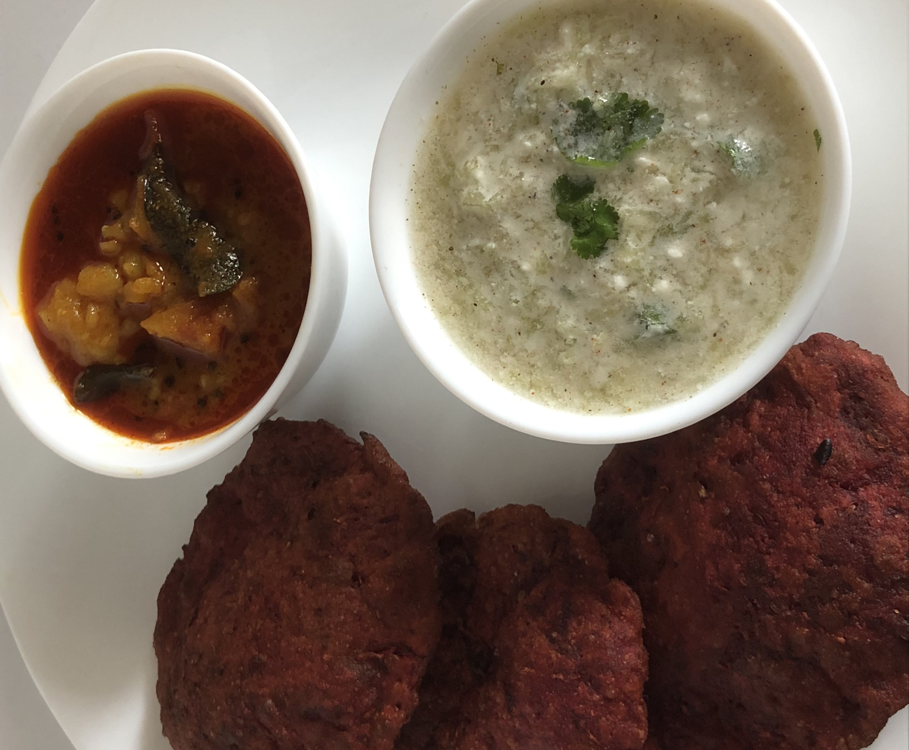

Poori is a popular dish which is made in every house in across India. It is deep fried bread made of whole wheat atta, normally served with any savoury and spicy curry or any stir fry vegetables or any Raitas. Poori is also served with halwa during festivals like Navratri, Hanuman Jayanti etc. There are many kinds of Poori dishes in India like Aloo Poori, Masala Poori, stuffed Poori that is called Kachori in India.

    

To make soft Pooris add milk instead of water while preparing Poori dough. To enhance flavour of any Poori add little salt and little oil (for giving Moyan) during dough formation and let the dough rest for half an hour.

Beetroot Poori can be served with any spicy vegetable curry like Aloo Tamater or any Raita or Achar.

Here is how to make this Beetroot Poori

    

        <dl class="row">
            <dt class="col-sm-4">Cuisine</dt><dd class="col-sm-7">North Indian</dd>
            <dt class="col-sm-4">Course</dt><dd class="col-sm-7">Breakfast, Lunch and Dinner</dd>
            <dt class="col-sm-4">Diet</dt><dd class="col-sm-7">Vegetarian</dd>
            <dt class="col-sm-4">Equipments</dt><dd class="col-sm-7">Kadai (Wok) / Heavy Bottomed Pan</dd>
        </dl>
    

    

        <dl class="row">
            <dt class="col-sm-5">Prep. Time</dt><dd class="col-sm-7">20 mins</dd>
            <dt class="col-sm-5">Cooking Time</dt><dd class="col-sm-7">20 mins</dd>
            <dt class="col-sm-5">Total Time</dt><dd class="col-sm-7">40 mins</dd>
            <dt class="col-sm-5">Makes</dt><dd class="col-sm-7">2 Servings</dd>
        </dl>
    

    
<h5 class="font-weight-bold">Ingredients</h5>

    

        <ul class="post-list" style="line-height: 200%">
            <li>1 cup Grated Beetroot</li>
            <li>1½ cup Wheat Flour</li>
            <li>½ tsp Grated Ginger</li>
            <li>¼ tbsp Cumin Seeds</li>
            <li>2-3 Chopped Green chillies</li>
            <li>¼ Chaat masala</li>
            <li>Salt to taste</li>
            <li>2 tbsp oil (for giving Moyan)</li>
        </ul>
    

    
<h5 class="font-weight-bold">Recipe Steps</h5>

    

        <ol class="post-list text-justify" style="line-height: 200%">
            <li style="margin-bottom:5px;">Take a large Mixing bowl. Add wheat flour, salt, cumin seeds, grated beetroot, grated Ginger, chaat masala, green chilies and oil (For giving Moyan) and make a dough and keep it aside in a bowl covered.</li>
            <li style="margin-bottom:5px;">Heat oil in Kadhai.</li>
            <li style="margin-bottom:5px;">Roll down Beetroot poori dough balls on chakla and fry it in oil from both sides.</li>
            <li style="margin-bottom:5px;">Serve These beautiful, tasty Beetroot poori with Raita or Curry or Aachar.</li>
        </ol>
    

    

        

            <iframe width="100%" height="315" src="https://www.youtube.com/embed/LzA6cF1B-jw" frameborder="0" allow="accelerometer; autoplay; encrypted-media; gyroscope; picture-in-picture" allowfullscreen></iframe>
        

    

 
