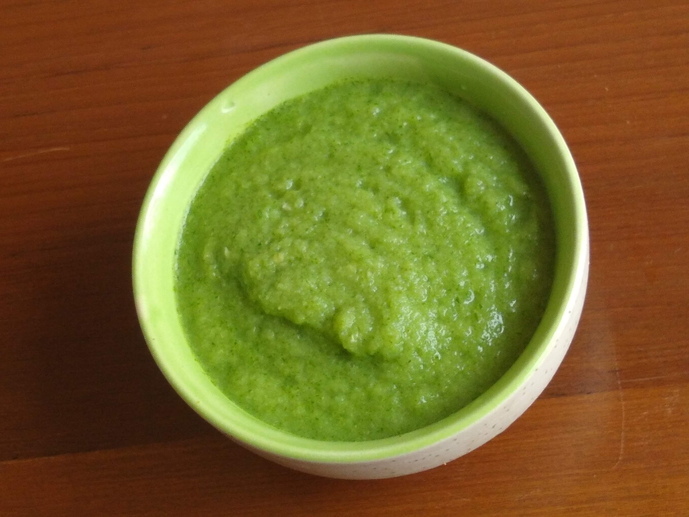

Amla Chutney is spicy and tangy chutney which is a powerpack of Vitamin C and many antioxidants. Amla chutney is prepared by blending fresh Amla pieces, fresh coriander leaves and many other ingredients.

    

Amla is fruit originated in India that is why it is also called Indian Goosebeery. It is an excellent source of Vitamin C, hence helps in boosting your immunity, Metabolism and prevents many viral and bacterial diseases. Many research across the world shows that amla helps in preventing development of Cancer cells.

Amla has many medicinal uses like it helps in hair growth, slows down hair greying process, improve eyesight and glowing skin. Amla chutney is served as a side dish with Dosa, Dal Rice, Stuffed Paratha, pakora, vada etc.

Here is how to make this Amla Chutney

    

        <dl class="row">
            <dt class="col-sm-4">Cuisine</dt><dd class="col-sm-7">North Indian and South Indian</dd>
            <dt class="col-sm-4">Course</dt><dd class="col-sm-7">Breakfast, Lunch and Dinner</dd>
            <dt class="col-sm-4">Diet</dt><dd class="col-sm-7">Vegetarian</dd>
            <dt class="col-sm-4">Equipments</dt><dd class="col-sm-7">Mixer Grinder/ Silbatta (Stone Grinding)</dd>
        </dl>
    

    

        <dl class="row">
            <dt class="col-sm-5">Prep. Time</dt><dd class="col-sm-7">10 mins</dd>
            <dt class="col-sm-5">Cooking Time</dt><dd class="col-sm-7">5 mins</dd>
            <dt class="col-sm-5">Total Time</dt><dd class="col-sm-7">15 mins</dd>
            <dt class="col-sm-5">Makes</dt><dd class="col-sm-7">4 Servings</dd>
        </dl>
    

    
<h5 class="font-weight-bold">Ingredients</h5>

    

        <ul class="post-list" style="line-height: 200%">
            <li>5-6 Amla Pieces</li>
            <li>3-4 Garlic Cloves</li>
            <li>Chopped coriander leaves</li>
            <li>2-3 Chopped Green chillies</li>
            <li>½ tsp Mustard Oil</li>
            <li>Salt to taste</li>
        </ul>
    

    
<h5 class="font-weight-bold">Recipe Steps</h5>

    

        <ol class="post-list text-justify" style="line-height: 200%">
            <li style="margin-bottom:5px;">Boil Amla pieces in water for 7-8 minutes. Let the amla pieces remain in water after boiling for another two minutes.</li>
        <li style="margin-bottom:5px;">Chopped the boiled Amla into small pieces. Remove its seeds.</li>
        <li style="margin-bottom:5px;">Blend all ingredients except Mustard oil that is Garlic, Coriander leaves, green chillies,Boiled amla pieces and salt together either with the help of Mixer grinder or Silbatta(Grinding stone)</li>
        <li style="margin-bottom:5px;">When Chutney is prepared, add raw mustard oil in it. Mix Well. Mustard oil reduces the sour taste of Amla. Mustard oil also helps in making amla chutney fresh for long time.</li>
        </ol>
    

    

        

            <iframe width="100%" height="315" src="https://www.youtube.com/embed/sv0CL-Ux8eA" frameborder="0" allow="accelerometer; autoplay; encrypted-media; gyroscope; picture-in-picture" allowfullscreen></iframe>
        

    

 
