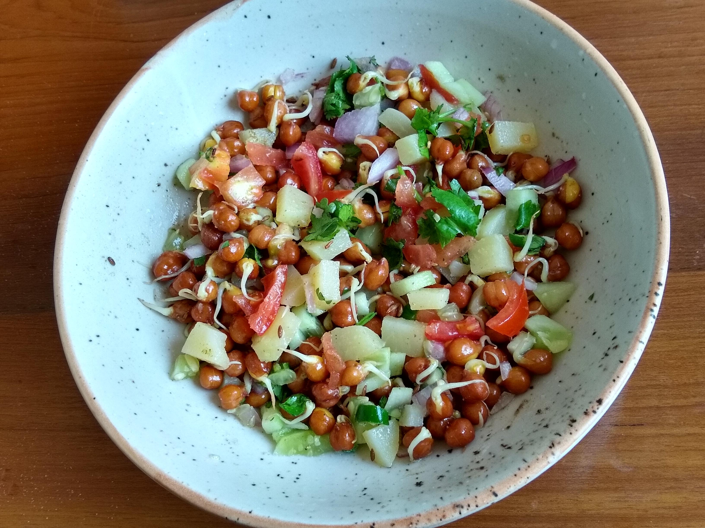

Sprouted Black Chana chaat is a nutrition enriched food that everyone should have in their diet. Sprouting any grain like Moong dal or Black chana etc. causes increased activities of enzymes, which in turn improve the content of total protein, fat, certain essential amino acids, total sugar, vitamins in any cereal or grains.

    

Chaat is a savoury snack that originated in Uttar Pradesh, India and now has become popular across the whole world. In India sprouted Black chana chaat is available at many roadside stalls to Five star restaurants.

Many Dietitians in India suggest eating sprouts daily, as it is quite helpful in becoming  healthy and fit for your whole life. This homemade sprouted kala chana chaat can be prepared in two ways, mentioned in Recipe steps below. Cooking through both the ways have the same nutrition content so one can cook according to any of the ways.

At my home, sprouted black chana chaat is my husband's favourite snack. He demands me to cook this chaat every other day. So friends, this is a must have recipe in your meal plan as its nutrition packed, immunity booster. Many Recipes can be made from this sprouted Kala chana chaat like Kebabs, curries, etc.

Here is how to make this Steamed Black Chana Chaat

    

        <dl class="row">
            <dt class="col-sm-4">Cuisine</dt><dd class="col-sm-7">North Indian Starter</dd>
            <dt class="col-sm-4">Course</dt><dd class="col-sm-7">Breakfast and Evening Snacks</dd>
            <dt class="col-sm-4">Diet</dt><dd class="col-sm-7">Vegetarian</dd>
            <dt class="col-sm-4">Equipments</dt><dd class="col-sm-7">Kadai (Wok) / Heavy Bottomed Pan</dd>
        </dl>
    

    

        <dl class="row">
            <dt class="col-sm-5">Prep. Time</dt><dd class="col-sm-7">20 mins</dd>
            <dt class="col-sm-5">Cooking Time</dt><dd class="col-sm-7">20 mins</dd>
            <dt class="col-sm-5">Total Time</dt><dd class="col-sm-7">40 mins</dd>
            <dt class="col-sm-5">Makes</dt><dd class="col-sm-7">2 Servings</dd>
        </dl>
    

    
<h5 class="font-weight-bold">Ingredients</h5>

    

        <ul class="post-list" style="line-height: 200%">
            <li>1 cup Sprouted Kala chana</li>
            <li>1 chopped Boiled Potato</li>
            <li>½ cup chopped Cucumber</li>
            <li>½ cup chopped Onions</li>
            <li>1 tbsp chopped Tomato</li>
            <li>1 tbsp chopped coriander leaves</li>
            <li>1 tbsp chopped green chili</li>
            <li>¼ tsp Cumin / Jeera</li>
            <li>¼ tsp Chaat masala</li>
            <li>Lemon Juice</li>
            <li>Salt to taste</li>
            <li>2 tsp oil</li>
        </ul>
    

    
<h5 class="font-weight-bold">Recipe Steps</h5>
 

    

        <h6 class="font-weight-bold">Method 1 (Without Sprouting)</h6>
        <ol class="post-list text-justify" style="line-height: 200%">
            <li style="margin-bottom:5px;">Soak kala chana or black chickpeas for 8-9 hours in water.</li>
            <li style="margin-bottom:5px;">Boil kala chana or black chickpeas in a cooker till 3-4 whistles. Add salt and little oil while boiling.</li>
            <li style="margin-bottom:5px;">Heat a kadhai and add 1 tbsp oil in it. Put cumin seeds/ jeera in oil and let the jeera splutter. After that add boiled kala chana in kadhai. Mix well. Cook these kala chana only for 3-4 minutes on medium to high flame.</li>
            <li style="margin-bottom:5px;">Transfer the boiled kala chana from kadhai to a mixing bowl and add chopped onions, chopped green chillies, chopped cucumber, chopped boiled potato, chopped tomato, chopped coriander leaves, chaat masala and lemon juice in it. Mix well.</li>
            <li style="margin-bottom:5px;">Serve hot with Tea / Coffee.</li>
        </ol>
        <h6 class="font-weight-bold">Method 2 (With Sprouting)</h6>
        <ol class="post-list text-justify" style="line-height: 200%">
            <li style="margin-bottom:5px;">Soak kala chana or black chickpeas for 8-9 hours in water.</li>
            <li style="margin-bottom:5px;">After 9 hours, tie the soaked kala chana in a muslin cloth for 2 days or you can make sprouts in a sprout maker which is easily available in the market or online. Length of the sprouts depend on how many days  kala chana is tied in a muslin cloth or kept in a sprout maker.</li>
            <li style="margin-bottom:5px;">Sprout maker is more easy and hygienic option to make sprouts than Muslin cloth option.</li>
            <li style="margin-bottom:5px;">Heat a kadhai and add 1 tbsp oil in it. Put cumin seeds/ jeera in oil and let the jeera splutter. After that add Sprouted kala chana in kadhai. Mix well. Cook these kala chana only for 3-4 minutes on medium to high flame.</li>
            <li style="margin-bottom:5px;">Transfer the sprouted kala chana from kadhai to a mixing bowl and add chopped onions, chopped green chillies, chopped cucumber, chopped boiled potato, chopped tomato, chopped coriander leaves, chaat masala and lemon juice in it . Mix well.</li>
            <li style="margin-bottom:5px;">Serve hot with Tea / Coffee.</li>
        </ol>
        
Purchase links of Sprout maker:

        <ul class="post-list" style="line-height: 200%">
            <li><a href="https://www.amazon.in/INVOSS-Plastic-Sprout-Popular-Multicolor/dp/B07QLZ6MVV">INVOSS-Plastic-Sprouter</a></li>
            <li><a href="https://www.amazon.in/Teneza-Organic-Plastic-Hygienic-Container/dp/B082QVK544">Teneza-Organic-Plastic-Container</a></li>
            <li><a href="https://www.amazon.in/Arisudan-Plastic-Hygienic-Sprout-Standard/dp/B07WHQ16LN">Arisudan-Plastic-Hygienic-Sprouter</a></li>
        </ul>
    

    

        

            <iframe width="100%" height="315" src="https://www.youtube.com/embed/zDEYystcvBE" frameborder="0" allow="accelerometer; autoplay; encrypted-media; gyroscope; picture-in-picture" allowfullscreen></iframe>
        

    

 
