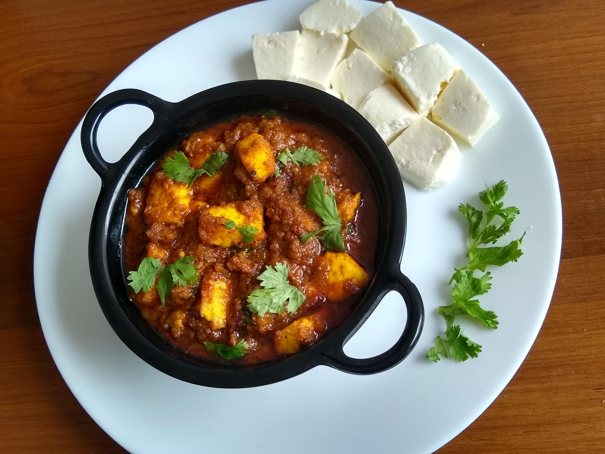

Kadhai Paneer is the most famous Paneer gravy dish across the world. Kadhai Paneer originated from North India, now liked by every tenth person in the world. This Kadhai Paneer is so famous in India that it is served in most of the restaurants, Dhabas and even served during any party or marriage function.

    

Kadhai Paneer is a thick gravy recipe, normally served with Naan / Paratha / Roti and Jeera Rice. Kadhai Paneer as the name suggests is cooked in a vessel called Kadhai. This recipe is a perfect blend of Indian spices and Masalas. This recipe is made up of cost effective ingredients and are easily available in every Indian kitchen.

Many People in India prepare Paneer or cottage cheese at home. There are many other recipes which resemble this like Shahi Paneer, Matar Paneer, Chilli Paneer etc. This dish is so auspicious that I cook this recipe during any get together at my home. This dish can be made easily in large quantities.

Here is how to make this Kadhai Paneer

    

        <dl class="row">
            <dt class="col-sm-4">Cuisine</dt><dd class="col-sm-7">North Indian Curry</dd>
            <dt class="col-sm-4">Course</dt><dd class="col-sm-7">Lunch and Dinner</dd>
            <dt class="col-sm-4">Diet</dt><dd class="col-sm-7">Vegetarian</dd>
            <dt class="col-sm-4">Equipments</dt><dd class="col-sm-7">Kadai (Wok) / Heavy Bottomed Pan</dd>
        </dl>
    

    

        <dl class="row">
            <dt class="col-sm-5">Prep. Time</dt><dd class="col-sm-7">15 mins</dd>
            <dt class="col-sm-5">Cooking Time</dt><dd class="col-sm-7">25 mins</dd>
            <dt class="col-sm-5">Total Time</dt><dd class="col-sm-7">40 mins</dd>
            <dt class="col-sm-5">Makes</dt><dd class="col-sm-7">2 Servings</dd>
        </dl>
    

    
<h5 class="font-weight-bold">Ingredients</h5>

    

        <ul class="post-list" style="line-height: 200%">
            <li>1 cup Paneer cubes</li>
            <li>1 cup Onion Paste</li>
            <li>1 cup Tomato Puree</li>
            <li>1 inch Ginger</li>
            <li>5-6 cloves of Garlic</li>
            <li>3-4 Green chilies</li>
            <li>¼ tsp Turmeric Powder</li>
            <li>¼ tsp  Red chili Powder</li>
            <li>¼ tsp Coriander Powder</li>
            <li>½ tsp Kasuri methi</li>
            <li>¼ tsp Roasted Cumin (Jeera) Powder</li>
            <li>½ tsp Garam Masala</li>
            <li>Salt to taste</li>
            <li>Chopped Coriander leaves</li>
            <li>Oil for Cooking</li>
        </ul>
    

    
<h5 class="font-weight-bold">Recipe Steps</h5>

    

        <ol class="post-list text-justify" style="line-height: 200%">
            <li style="margin-bottom:5px;">Heat oil in a kadhai. Fry Panner cubes in oil and keep it aside in a plate.</li>
            <li style="margin-bottom:5px;">Prepare a paste of ginger, garlic and green chili and keep it aside in a bowl.</li>
            <li style="margin-bottom:5px;">Now add Onion paste in kadhai and saute these onions till it colour changes to translucent Pink.</li>
            <li style="margin-bottom:5px;">Now add paste of ginger,garlic and green chilli in the kadhai and cook or Bhuno the whole masala for 7-8 minutes with the lid covered on low flame.</li>
            <li style="margin-bottom:5px;">Now add tomato puree and cook the masala till the oil separates on low flame.</li>
            <li style="margin-bottom:5px;">Add turmeric powder, red chili powder, coriander powder, roasted jeera powder, garam masala, kasuri methi , sugar and salt in the masala cooked in kadhai.</li>
            <li style="margin-bottom:5px;">Mix it well.</li>
            <li style="margin-bottom:5px;">Add little water to cook the spices which are added in the masala earlier.Cover the lid of the kadhai and cook this masala for 3-4 minutes on low flame.</li>
            <li style="margin-bottom:5px;">Now add water to make the gravy  of the dish. Let the Rasa / Tari /Gravy come to boil.</li>
            <li style="margin-bottom:5px;">Now add fried paneer cubes in the gravy and again cook for 7-8 minutes on low flame till the gravy stats thickens and each cube of paneer absorbs the flavour of curry.</li>
            <li style="margin-bottom:5px;">Garnish this kadhai paneer with chopped coriander leaves and ginger juliennes.</li>
            <li style="margin-bottom:5px;">Serve hot with Butter Naan and jeera rice.</li>
        </ol>
        
Purchase links:

        <ul class="post-list" style="line-height: 200%">
            <li><a href="https://www.amazon.in/Stahl-Stainless-Artisan-Kadhai-1-Piece/dp/B011VH40GA">Stahl Stainless Kadhai</a></li>
        </ul>
    

    

        

            <iframe width="100%" height="315" src="https://www.youtube.com/embed/HHa0K8cYxlY" frameborder="0" allow="accelerometer; autoplay; encrypted-media; gyroscope; picture-in-picture" allowfullscreen></iframe>
        

    

 
