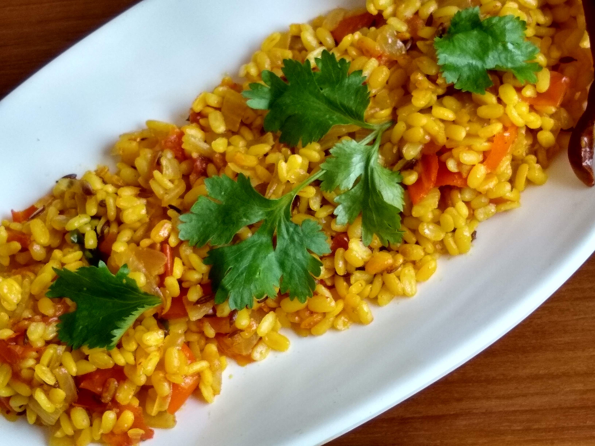

Steamed Moong Dal Upma is a healthy breakfast option for people who want to eat something healthy and can be prepared within a couple of minutes. Many dietitians in India suggest to eat breakfast that is full of minerals and fibre in it. This moong dal upma contains lots of nutrients like protein, minerals, fibre and vitamins in it.

    

This recipe is best for growing kids and for those person who are suffer from gastric problems, high cholestrol, high blood pressure, diabeties and obese persons who want to achieve weight loss. This moong dal upma is an excellent option for kids tiffin or lunchbox.

As Moong dal is easy to digest and contains lots of protein in it, everyone should eat this tasty and healthy breakfast. Calorie count of this Moong dal upma recipe is also very less. This Homemade Moong dal upma is easy to make as ingredients used in this recipe are easily found in every kitchen.

Here is how to make this Steamed Moong Dal Upma

    

        <dl class="row">
            <dt class="col-sm-4">Cuisine</dt><dd class="col-sm-7">North Indian Starter</dd>
            <dt class="col-sm-4">Course</dt><dd class="col-sm-7">Breakfast and Evening Snacks</dd>
            <dt class="col-sm-4">Diet</dt><dd class="col-sm-7">Vegetarian</dd>
            <dt class="col-sm-4">Equipments</dt><dd class="col-sm-7">Kadai (Wok) / Heavy Bottomed Pan</dd>
        </dl>
    

    

        <dl class="row">
            <dt class="col-sm-5">Prep. Time</dt><dd class="col-sm-7">2 hours</dd>
            <dt class="col-sm-5">Cooking Time</dt><dd class="col-sm-7">20 mins</dd>
            <dt class="col-sm-5">Total Time</dt><dd class="col-sm-7">2 hours 20 mins</dd>
            <dt class="col-sm-5">Makes</dt><dd class="col-sm-7">2 Servings</dd>
        </dl>
    

    
<h5 class="font-weight-bold">Ingredients</h5>

    

        <ul class="post-list" style="line-height: 200%">
            <li>1 cup water Soaked Moong Dal</li>
            <li>⅓ cup Chopped Onion</li>
            <li>⅓ cup Chopped Tomato</li>
            <li>¼ tsp Chopped Chilli</li>
            <li>2 Dry Red Chilli</li>
            <li>Lemon</li>
            <li>7-8 Curry leaves / Kadi Patta</li>
            <li>½ tsp Turmeric Powder</li>
            <li>½ tsp Cumin seeds/Jeera</li>
            <li>½ tsp Chaat Masala</li>
            <li>Chopped Coriander leaves</li>
            <li>¼ tsp Hing</li>
            <li>½ tsp Red chilli Powder</li>
            <li>Salt to taste</li>
            <li>Oil for Cooking</li>
        </ul>
    

    
<h5 class="font-weight-bold">Recipe Steps</h5>

    

        <ol class="post-list text-justify" style="line-height: 200%">
            <li style="margin-bottom:5px;">Heat a fry pan or kadhai. Pour 2 tbsp oil in it.</li>
            <li style="margin-bottom:5px;">Now add hing, Cumin seeds and dry red chili in the oil. Let the cumin seeds splutter.</li>
            <li style="margin-bottom:5px;">Now add chopped onions in kadhai followed by adding curry leaves and chopped chilli. Cook these Onions till the colour of onions changes to translucent Pink.</li>
            <li style="margin-bottom:5px;">Now add chopped Tomato in kadhai and cook these tomatoes well.</li>
            <li style="margin-bottom:5px;">Add Red chilli powder,Turmeric powder and Chaat masala in the kadhai. Mix well.</li>
            <li style="margin-bottom:5px;">Add soaked Moong Dal in the kadhai. Mix it well.</li>
            <li style="margin-bottom:5px;">Now add a little water (⅓ cup water) in the kadhai and stir the whole upma cooked in the kadai. Cover the lid of the kadhai and cook it for 8-10 minutes on low flame.</li>
            <li style="margin-bottom:5px;">After 8 minutes, Switch off the gas but do not open the lid of the kadhai.</li>
            <li style="margin-bottom:5px;">Let the mixture cook in steam for another two minutes with the lid covered and no flame.</li>
            <li style="margin-bottom:5px;">Transfer the Moong dal upma on a plate and garnish with chopped coriander leaves.</li>
            <li style="margin-bottom:5px;">Serve Hot.</li>
        </ol>
    

    

        

            <iframe width="100%" height="315" src="https://www.youtube.com/embed/lJPyVmO_DdM" frameborder="0" allow="accelerometer; autoplay; encrypted-media; gyroscope; picture-in-picture" allowfullscreen></iframe>
        

    

 
