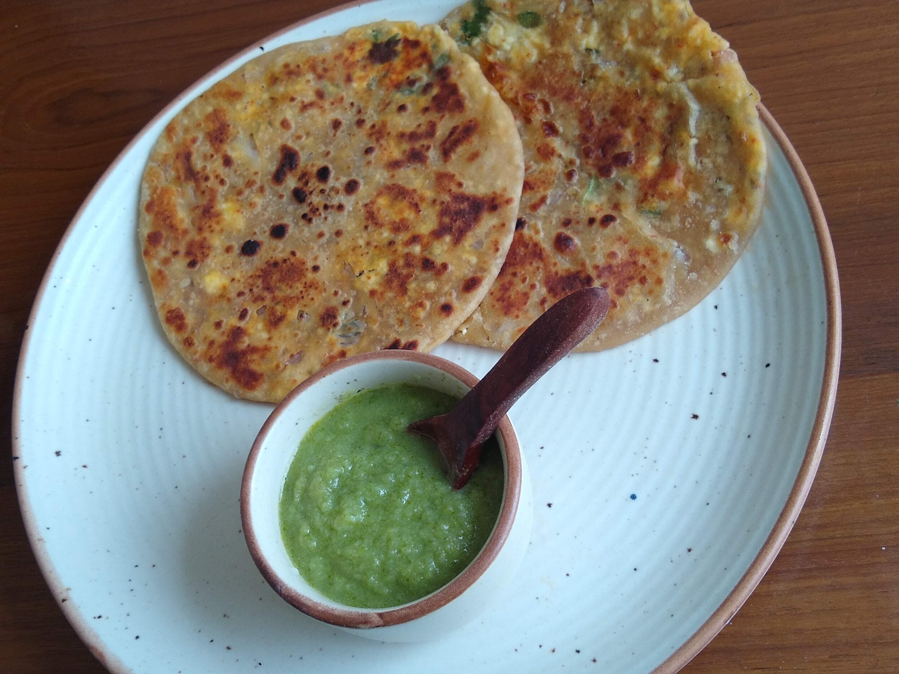

Paneer Paratha is North Indian style stuffed flatbread eaten with any pickle like Mango pickle or Green chili pickle and any spicy chutney like Amla chutney or Raw Mango chutney. Paneer Paratha with big glass of Lassi (sweetened curd) is a classic combination in India. The origin of Paneer Paratha is considered to be Punjab.

    

Paneer paratha is a healthy breakfast option as it is stuffed with Paneer and various other Indian spices. Paneer paratha is a powerpack of many nutrients as paneer or cottage cheese is made up of milk.

This paratha is very easy to make and delicious to eat. This paratha is served in many Indian restaurants around the world. Many roadside stalls also sell these stuffed paratha with extra butter on it.

Paneer paratha is the best option for kids lunch box as it is easily made and ingredients used in making this paneer stuffed paratha is readily available.

Here is how to make this Paneer Paratha

    

        <dl class="row">
            <dt class="col-sm-4">Cuisine</dt><dd class="col-sm-7">North Indian</dd>
            <dt class="col-sm-4">Course</dt><dd class="col-sm-7">Breakfast, Lunch and Dinner</dd>
            <dt class="col-sm-4">Diet</dt><dd class="col-sm-7">Vegetarian</dd>
            <dt class="col-sm-4">Equipments</dt><dd class="col-sm-7">Non stick Tawa / Cast iron Tawa</dd>
        </dl>
    

    

        <dl class="row">
            <dt class="col-sm-5">Prep. Time</dt><dd class="col-sm-7">10 mins</dd>
            <dt class="col-sm-5">Cooking Time</dt><dd class="col-sm-7">10 mins</dd>
            <dt class="col-sm-5">Total Time</dt><dd class="col-sm-7">20 mins</dd>
            <dt class="col-sm-5">Makes</dt><dd class="col-sm-7">7 - 8 Parathas</dd>
        </dl>
    

    
<h5 class="font-weight-bold">Ingredients</h5>

    

        <ul class="post-list" style="line-height: 200%">
            <li>200 gm Paneer</li>
            <li>3 Cups Wheat Flour</li>
            <li>1 Chopped Onion</li>
            <li>3-4 chopped green chilies</li>
            <li>¼ tsp Cumin seeds</li>
            <li>¼ tsp Chaat masala</li>
            <li>Chopped Coriander leaves</li>
            <li>¼ tsp Red chili powder</li>
            <li>Salt to taste</li>
            <li>Oil / Ghee for cooking</li>
        </ul>
    

    
<h5 class="font-weight-bold">Recipe Steps</h5>

    

        <ol class="post-list text-justify" style="line-height: 200%">
            <li style="margin-bottom:5px;">Prepare the dough by mixing wheat flour, little salt, 2 tbsp oil and warm water and keep it aside covered.</li>
            <li style="margin-bottom:5px;">Take a mixing bowl and grate paneer in it.</li>
            <li style="margin-bottom:5px;">Add red chili powder, chaat masala, chopped onion, chopped green chilli, cumin seeds, salt and chopped coriander leaves. Mix well. Stuffing of Paratha is ready.</li>
            <li style="margin-bottom:5px;">Divide dough into equal parts.</li>
            <li style="margin-bottom:5px;">Take a dough ball, flatten it by your hand, make a small katori or bowl of dough and stuff the paneer mixture in it.</li>
            <li style="margin-bottom:5px;">Roll down the stuffed dough balls with the help of a rolling pin on a rolling board or chakla.</li>
            <li style="margin-bottom:5px;">Edges of the paratha should be thin and middle of the paratha should be thick as compared to edges of paratha.This makes paneer paratha more fluffy.</li>
            <li style="margin-bottom:5px;">Cook these paratha from both sides on tawa by brushing oil or ghee on it.</li>
            <li style="margin-bottom:5px;">Serve hot with any spicy and sour Chutney like Amla Chutney or Mango chutney or tomato chutney.</li>
        </ol>
    

    

        

            <iframe width="100%" height="315" src="https://www.youtube.com/embed/XCphy_-yqYE" frameborder="0" allow="accelerometer; autoplay; encrypted-media; gyroscope; picture-in-picture" allowfullscreen></iframe>
        

    

 
