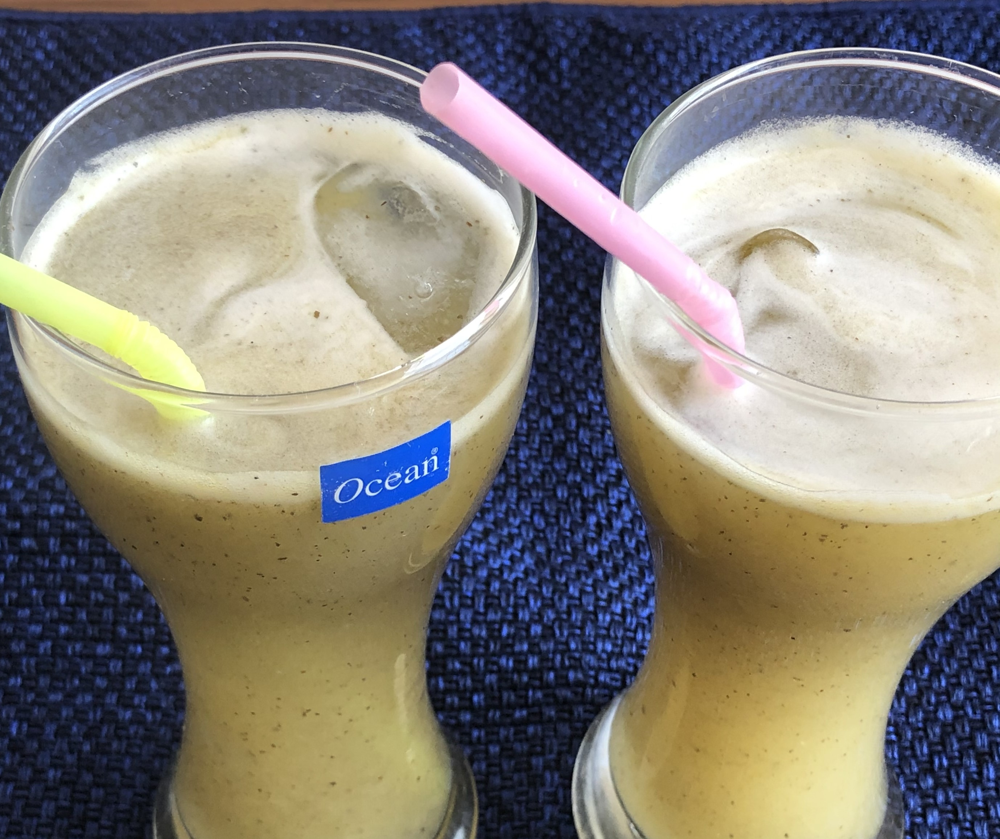

Raw Mango Panaa is the desi drink which we Indians usually enjoy drinking during summers. This recipe is made during summer season as in this season raw mango is available in abundance. This desi drink provides coolness to the body during summer season.

    

This Raw mango Panaa acts as a coolant when a person suffering from intensive heat, drinks it. The heat resistant properties of this Raw Mango Panaa make it as a perfect Desi drink or beverage in India.

This Aam ka Panaa is made up of Raw mangoes, Pudina (dried mint leaves powder) Powder, Roasted Cumin Powder and many other ingredients. The color of this drink is greenish yellow and the taste of this Panaa is sweet and sour. This Aam ka Panaa is prepared in concentrated form and when the person wants to drink this Aam ka Panaa then he/she should add both chilled water and concentrate aam Panaa in equal quantities.

Everyone should drink this desi drink as it helps us in fighting intensive heat and also helps in digestion process. This drink is quite helpful when a person suffers from Sun struck(Loo lagna in hindi and also prevents stone formation in kidney.

Here is how to make this Raw Mango Panaa

    

        <dl class="row">
            <dt class="col-sm-4">Cuisine</dt><dd class="col-sm-7">North Indian</dd>
            <dt class="col-sm-4">Course</dt><dd class="col-sm-7">Desi Drinks</dd>
            <dt class="col-sm-4">Diet</dt><dd class="col-sm-7">Vegetarian</dd>
            <dt class="col-sm-4">Equipments</dt><dd class="col-sm-7">Big Bowl / Electric Blender / Pressure Cooker</dd>
        </dl>
    

    

        <dl class="row">
            <dt class="col-sm-5">Prep. Time</dt><dd class="col-sm-7">30 mins</dd>
            <dt class="col-sm-5">Cooking Time</dt><dd class="col-sm-7">5 mins</dd>
            <dt class="col-sm-5">Total Time</dt><dd class="col-sm-7">35 mins</dd>
            <dt class="col-sm-5">Makes</dt><dd class="col-sm-7">8-10 Servings</dd>
        </dl>
    

    
<h5 class="font-weight-bold">Ingredients</h5>

    

        <ul class="post-list" style="line-height: 200%">
            <li>3 Raw Mangoes</li>
            <li>1 tbsp Roasted Jeera /Cumin Powder</li>
            <li>¼ tsp Black salt</li>
            <li>½ tbsp Sugar</li>
            <li>½ tsp Dried Pudina leaves</li>
            <li>3 cups of Water</li>
            <li>Salt to taste</li>
        </ul>
    

    
<h5 class="font-weight-bold">Recipe Steps</h5>
 

    

        <ol class="post-list text-justify" style="line-height: 200%">
            <li style="margin-bottom:5px;">Wash and dry all the Raw Mangoes. Remove the stalk of each mango. Peel the mangoes and keep it aside.</li>
            <li style="margin-bottom:5px;">Boil these peeled mangoes in 3 cups of water till two whistles.</li>
            <li style="margin-bottom:5px;">Transfer the Boiled Mangoes with boiled water containing Pulps of raw mangoes in the mixing bowl.</li>
            <li style="margin-bottom:5px;">With the help of a spoon remove the remaining pulp from each raw mango guthli.</li>
            
<i class="fas fa-lightbulb"></i> Keep the Guthli (Mango Seed) aside on a plate. You can dry these guthli in sunlight and use it while making Dal recipes.

            <li style="margin-bottom:5px;">Add roasted cumin powder, salt, black salt, sugar and dried pudina powder in the Pulpy water.</li>
            <li style="margin-bottom:5px;">With the help of an electric blender, blend all the ingredients. Now concentrated Raw Mango Panaa is ready.</li>
            <li style="margin-bottom:5px;">Store this Raw mango Panaa in an airtight  bottle and keep it in a  Refrigerator. You Can use this safely for 15 days.</li>
            <li style="margin-bottom:5px;">When you want to drink Aam ka Panaa add equal quantities of chilled water and concentrated Aam ka Panaa. No need to add any Salt or sugar while making the drink as concentrated Raw mango Panaa already  contains all flavors in it.</li>
            <li style="margin-bottom:5px;">Add cubes of ice in each glass before serving.</li>
        </ol>
    

    

        

            <iframe width="100%" height="315" src="https://www.youtube.com/embed/5E7OkmF-aSM" frameborder="0" allow="accelerometer; autoplay; encrypted-media; gyroscope; picture-in-picture" allowfullscreen></iframe>
        

    

 
