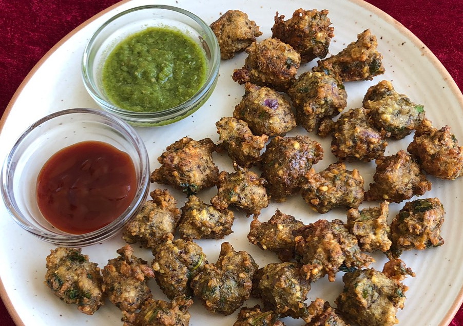

Chatpata Moong Dal Pakora is a very popular Starter Recipe in India. Chatpata Moong Dal Pakora is also called Mungodi. These crispy fried snacks served with Mint-coriander Chutney or Tomato Sauce and hot tea in breakfast or in evening snacks.

    

These Moong dal Pakora can be made from either yellow moong dal or Green Moong dal. This dish is delicious to eat and easy to make.

This is the best option for kids lunch boxes  and can also be served during Parties as a starter. Moong dal is a Powerhouse of Protein, vitamins and fibre in it thus make this dish easily digestible, healthy and nutritious.

Here is how to make this Moong Dal Pakoda / Mungodi

    

        <dl class="row">
            <dt class="col-sm-4">Cuisine</dt><dd class="col-sm-7">North Indian Starter</dd>
            <dt class="col-sm-4">Course</dt><dd class="col-sm-7">Breakfast and Evening Snacks</dd>
            <dt class="col-sm-4">Diet</dt><dd class="col-sm-7">Vegetarian</dd>
            <dt class="col-sm-4">Equipments</dt><dd class="col-sm-7">Kadai (Wok) / Heavy Bottomed Pan</dd>
        </dl>
    

    

        <dl class="row">
            <dt class="col-sm-5">Prep. Time</dt><dd class="col-sm-7">20 mins</dd>
            <dt class="col-sm-5">Cooking Time</dt><dd class="col-sm-7">15 mins</dd>
            <dt class="col-sm-5">Total Time</dt><dd class="col-sm-7">35 mins</dd>
            <dt class="col-sm-5">Makes</dt><dd class="col-sm-7">3-4 Servings</dd>
        </dl>
    

    
<h5 class="font-weight-bold">Ingredients</h5>

    

        <ul class="post-list" style="line-height: 200%">
            <li>1½ Cup Moong Dal</li>
            <li>½ Cup Fine chopped Onion</li>
            <li>4-5 Fine chopped Green chillies</li>
            <li>¼ tsp Grated Ginger</li>
            <li>Chopped Coriander Leaves</li>
            <li>½ tsp Cumin seeds/Jeera</li>
            <li>¼ tsp Chaat Masala</li>
            <li>Pinch of Hing</li>
            <li>Salt to taste</li>
        </ul>
    

    
<h5 class="font-weight-bold">Recipe Steps</h5>

    

        <ol class="post-list text-justify" style="line-height: 200%">
            <li style="margin-bottom:5px;">Soak Moong dal overnight in water. Next day grind soaked Moong dal into the fine paste and transfer it into the mixing bowl.</li>
            <li style="margin-bottom:5px;">Add chopped onion, chopped chilli, grated ginger, chopped coriander leaves, chaat masala, cumin seeds,pinch of hing and salt into the mixing bowl.</li>
            <li style="margin-bottom:5px;">Mix well. Moong dal pakora batter is ready.</li>
            <li style="margin-bottom:5px;">Heat Oil in kadhai and fry these Moong dal pakora.</li>
            <li style="margin-bottom:5px;">Serve hot, crispy and chatpate Moong dal pakora with Mint Coriander Chutney and tea.</li>
        </ol>
    

 
