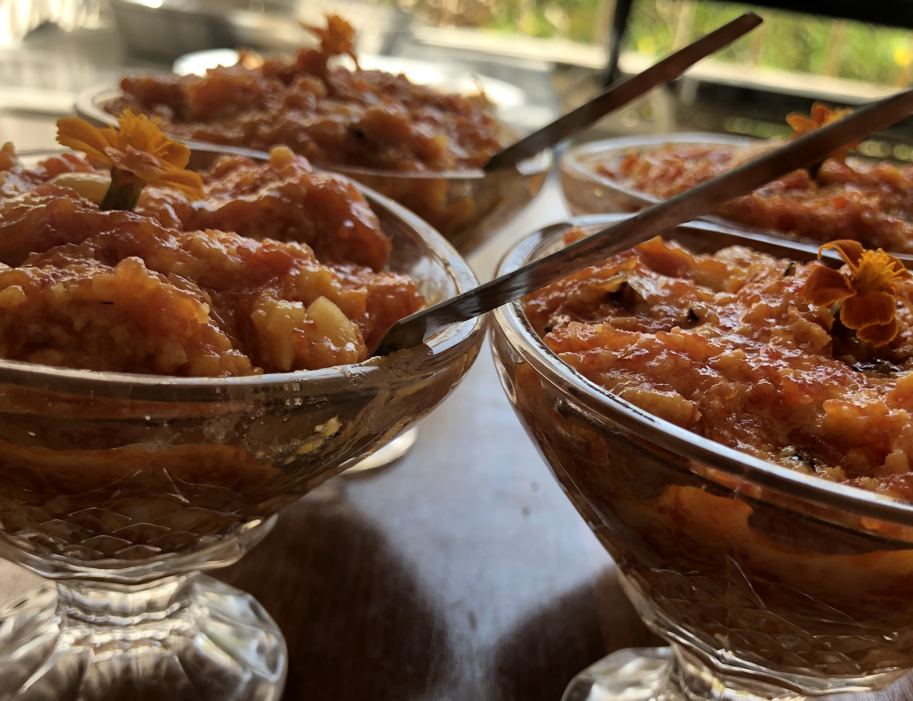

Gajar Halwa is a popular sweet dessert in India. Gajar ka halwa also called Gajar Pak / or Carrot Halwa. This Halwa is a slow cooked recipe, traditionally made by simmering grated  Red carrots with Milk, Khoya, Ghee, Sugar and dry fruits. Gajar Halwa is normally prepared during winters in india.

    

Some people prefer to eat hot steamy Gajar Halwa and some people like to eat chilled Gajar Halwa. This sweet dish is liked by everyone and it can be prepared easily at home as ingredients are easily available and also not costly.

Gajar ka halwa is loaded with lots of taste and flavours inside it and also very healthy to eat.

Here is how to make this Gajar Halwa.

    

        <dl class="row">
            <dt class="col-sm-4">Cuisine</dt><dd class="col-sm-7">North Indian</dd>
            <dt class="col-sm-4">Course</dt><dd class="col-sm-7">Dessert</dd>
            <dt class="col-sm-4">Diet</dt><dd class="col-sm-7">Vegetarian</dd>
            <dt class="col-sm-4">Equipments</dt><dd class="col-sm-7">Kadai (Wok) / Heavy Bottomed Pan</dd>
        </dl>
    

    

        <dl class="row">
            <dt class="col-sm-5">Prep. Time</dt><dd class="col-sm-7">20 mins</dd>
            <dt class="col-sm-5">Cooking Time</dt><dd class="col-sm-7">50 mins</dd>
            <dt class="col-sm-5">Total Time</dt><dd class="col-sm-7">1 hour 10 mins</dd>
            <dt class="col-sm-5">Makes</dt><dd class="col-sm-7">2 Servings</dd>
        </dl>
    

<section>
    

    

        
<h5 class="font-weight-bold">Ingredients</h5>

    

    

        
            
            <ul style="line-height: 200%">
                <li>1kg Grated Red Carrots</li>
                <li>2 tbsp Ghee</li>
                <li>700 gm Sugar</li>
                <li>2 tbsp Cardamom Powder</li>
                <li>500 gm Khoya</li>
                <li>2 litre Milk</li>
                <li>Chopped Cashew Nuts(10-12)</li>
                <li>Chopped Almonds(10-12)</li>
            </ul>
        

    

</section>

    
<h5 class="font-weight-bold">Recipe Steps</h5>

    

        <ol class="text-justify" style="line-height: 200%">
            <li style="margin-bottom:5px;">Take a large kadhai and heat it.</li>
            <li style="margin-bottom:5px;">Add Ghee in kadhai. Now add grated Carrots in it and mix well with ghee and let this cook for 5 minutes.</li>
            <li style="margin-bottom:5px;">Now add milk in the kadhai and stir it .Cover the lid of the kadhai and cook for 15 minutes.</li>
            <li style="margin-bottom:5px;">After 15 minutes milk and carrots mixture starts thickening. Now add Sugar, Almonds, Cashew Nuts, Cardamom Powder in the kadhai. Cover the lid of kadhai for another 15 minutes as when sugar cooks with carrot and milk mixture it also releases some water.</li>
            <li style="margin-bottom:5px;">Now after 15-20 minutes halwa starts thickens as water inside the halwa evaporates, now at this point continuously stir halwa with a spatula so that halwa does not get stuck to the bottom.</li>
            <li style="margin-bottom:5px;">Now add grated Khoya inside the halwa. Mix khoya and carrots mixture very well.</li>
            <li style="margin-bottom:5px;">After 5 mInutes Carrot Halwa is ready. Garnish with chopped almonds and Cashew Nuts.</li>
            <li style="margin-bottom:5px;">Serve Hot Gajar ka Halwa to your loved ones. They will surely enjoy this yummy Gajar ka halwa.</li>
        </ol>
    

    

        

            <iframe width="100%" height="315" src="https://www.youtube.com/embed/djtiCPrL35w" frameborder="0" allow="accelerometer; autoplay; encrypted-media; gyroscope; picture-in-picture" allowfullscreen></iframe>
        

    

 