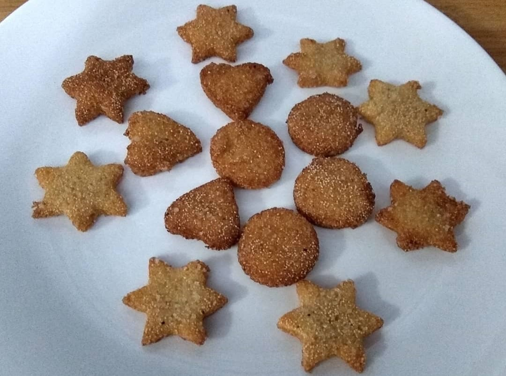

Semolina / Suji / Rava Cookies are simple, easy and tasty recipes made with Semolina(Suji), Wheat Flour(Atta), Sugar and Ghee. These delicious cookies are prepared just by using a few ingredients which are very healthy.

    

These suji biscuits can be prepared by two ways:
<ul style="line-height: 200%">
    <li>Fried in oil in a kadhai</li>
    <li>Baked in Oven</li>
</ul>

It is a healthy sweet snack which makes your kids more energetic. So whenever your little munchkins feel hungry, they want to eat these biscuits. These biscuits are much healthier and safer to eat as compared to market available biscuits which contain lots of preservatives.

These cookies are a great option for tea time snacks, liked by everyone, especially kids.

Here is how to make this Suji Cookies.

    

        <dl class="row">
            <dt class="col-sm-4">Cuisine</dt><dd class="col-sm-7">North Indian</dd>
            <dt class="col-sm-4">Course</dt><dd class="col-sm-7">Sweet Snacks</dd>
            <dt class="col-sm-4">Diet</dt><dd class="col-sm-7">Vegetarian</dd>
            <dt class="col-sm-4">Equipments</dt><dd class="col-sm-7">Kadai (Wok) / Heavy Bottomed Pan</dd>
        </dl>
    

    

        <dl class="row">
            <dt class="col-sm-5">Prep. Time</dt><dd class="col-sm-7">15 mins</dd>
            <dt class="col-sm-5">Cooking Time</dt><dd class="col-sm-7">15 mins</dd>
            <dt class="col-sm-5">Total Time</dt><dd class="col-sm-7">30 mins</dd>
            <dt class="col-sm-5">Makes</dt><dd class="col-sm-7">2 Servings</dd>
        </dl>
    

<section>
    

    

        
<h5 class="font-weight-bold">Ingredients</h5>

    

    

        
            
            <ul style="line-height: 200%">
                <li>2 cup Suji (Semolina)</li>
                <li>1 cup Wheat Flour</li>
                <li>1 cup Powdered Sugar</li>
                <li>1 cup Melted  Ghee</li>
                <li>½ cup Poppy Seeds(Posta dana)</li>
                <li>½ cup Milk</li>
            </ul>
        

    

</section>

    
<h5 class="font-weight-bold">Recipe Steps</h5>

    

        <ol class="text-justify" style="line-height: 200%">
            <li style="margin-bottom:5px;">In a big Parath or wide mixing bowl, add Semolina, Wheat flour and Sugar. Dry mix all the ingredients.</li>
            <li style="margin-bottom:5px;">Now Add melted Ghee in the Mixing bowl and mix well for giving moyan to the mixture.</li>
            <li style="margin-bottom:5px;">Now slowly add milk in a mixing bowl and make a dough. Cover the dough with any wet cloth and let the dough rest for 15 minutes.</li>
            <li style="margin-bottom:5px;">Heat oil in kadhai. Make medium size balls from this dough and roll down these balls on Chakla or any plain surface. Make a thick roti from this dough. Apply ghee on the Roti which is formed on chakla so that while rolling, dough doest get stuck on chakla.</li>
            <li style="margin-bottom:5px;">Now with the help of Cookie cutter cut different shapes of it and fry it in the oil on low flame till the color of cookies or Biscuits change to light golden brown.</li>
            <li style="margin-bottom:5px;">Enjoy these Semolina Cookies with Hot tea.</li>
        </ol>
    

    

        

            <iframe width="100%" height="315" src="https://www.youtube.com/embed/EtAqkJ4PIqg" frameborder="0" allow="accelerometer; autoplay; encrypted-media; gyroscope; picture-in-picture" allowfullscreen></iframe>
        

    

 