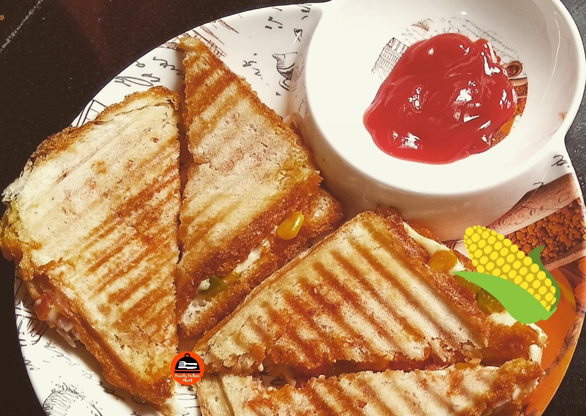

Creamy Corn Sandwich Is an easy, spicy and tasty sweet corn grilled sandwich recipe for breakfast or snacks. The Creamy, Cheesy filling of sweet corn and other herbs makes it more delicious.

    

This recipe of Sweet corn sandwich is easily found in any restaurant menu in the appetizer section. This is considered as the street foods which people love to eat with ketchup and green chutneys. This recipe is quick and easy to make and this also makes it one of the best options for kids lunchbox.

Here is how to make this Creamy Corn Sandwich.

    

        <dl class="row">
            <dt class="col-sm-4">Cuisine</dt><dd class="col-sm-7">North Indian</dd>
            <dt class="col-sm-4">Course</dt><dd class="col-sm-7">Breakfast</dd>
            <dt class="col-sm-4">Diet</dt><dd class="col-sm-7">Vegetarian</dd>
            <dt class="col-sm-4">Equipments</dt><dd class="col-sm-7">Kadai (Wok) / Grill Sandwich Maker</dd>
        </dl>
    

    

        <dl class="row">
            <dt class="col-sm-5">Prep. Time</dt><dd class="col-sm-7">15 mins</dd>
            <dt class="col-sm-5">Cooking Time</dt><dd class="col-sm-7">15 mins</dd>
            <dt class="col-sm-5">Total Time</dt><dd class="col-sm-7">30 mins</dd>
            <dt class="col-sm-5">Makes</dt><dd class="col-sm-7">2 Servings</dd>
        </dl>
    

    
<h5 class="font-weight-bold">Ingredients</h5>

    

        <ul class="post-list" style="line-height: 200%">
            <li>1 Fine chopped Onion</li>
            <li>1 Fine chopped Green Capcicum</li>
            <li>1 Fine chopped Yellow or Red Capcicum</li>
            <li>2-3 fine chopped Green Chilies</li>
            <li>1 Fine chopped Tomato</li>
            <li>1 cup Boiled Corns</li>
            <li>½ cup Grated Mozzarella cheese or 5-6 Amul cheese slices</li>
            <li>¼ tsbp  Chaat masala</li>
            <li>Salt to taste</li>
            <li>¼ tsbp Red chili powder</li>
            <li>½ cup Butter</li>
            <li>Tomato Sauce</li>
            <li>Chilly Sauce</li>
            <li>¼ tsp Ginger Garlic Powder</li>
        </ul>
    

    
<h5 class="font-weight-bold">Recipe Steps</h5>

    

        <ol class="post-list text-justify" style="line-height: 200%">
            <li style="margin-bottom:5px;">Heat a pan and add 2 tbsp of butter in it.</li>
            <li style="margin-bottom:5px;">Now add boiled corn, chopped red and green capcicum in a pan and toss these in butter for five minutes on medium to high flame so that these capcicum dont get soggy but remain crunchy. Keep these mixtures aside in a  mixing bowl.</li>
            <li style="margin-bottom:5px;">Now in the same mixing bowl add raw fine chopped Onion, raw fine chopped tomatoes ,chopped green chilies ,salt, chaat masala ,red chili powder and  ginger garlic Powder (Use 1 tsp of ginger garlic paste  as alternative of ginger garlic powder) and ½ tsp of butter, Mozzarella cheese in it.</li>
            <li style="margin-bottom:5px;">Mix 2 Tbsp of Tomato sauce and 2 tbsp of chilli sauce in a bowl and keep it aside. Apply these mixed sauce  paste on both  bread slices and put the corn filling in between these bread slices.</li>
            <li style="margin-bottom:5px;">Toast these sandwiches either in a grilled toaster or grilled tawa. Apply butter on both sides of the sandwich while toasting in a pan or tawa.</li>
            <li style="margin-bottom:5px;">Now the crisp cheesy, spicy creamy corn sandwich is ready.</li>
            <li style="margin-bottom:5px;">Serve hot with Tea/Coffee.</li>
        </ol>
    

    

        

            <iframe width="100%" height="315" src="https://www.youtube.com/embed/Af5ZsX1NL84" frameborder="0" allow="accelerometer; autoplay; encrypted-media; gyroscope; picture-in-picture" allowfullscreen></iframe>
        

    

 
