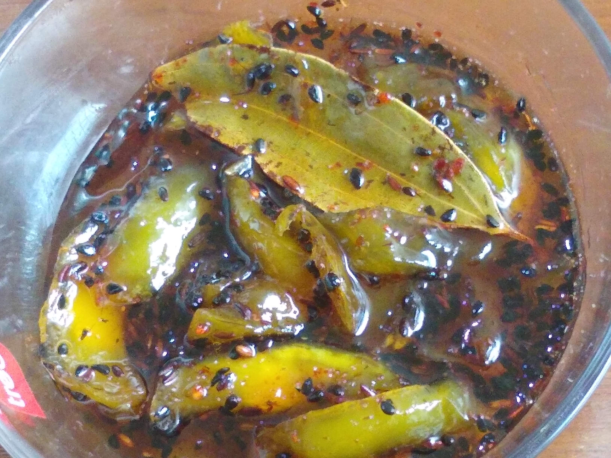

Raw Mango Galka is a North Indian style instant mango pickle which is sweet and sour in taste. Normally mango pickle takes at least a week to get ready for eating. But this sweet and sour raw mango pickle is prepared and ready to eat in half an hour.

    

This dish is prepared by using raw mangoes, sugar, salt, kalonji and various other spices. Many people add Jaggery instead of Sugar but it depends on the taste palette of different people. Some People like jaggery in galka and some people like sugar in galka.

In this recipe I have used Sugar to make raw mango galka. This galka is very yummy to eat. It is usually served with plain Paratha or stuffed Paratha and also served as a side dish in Indian Thali.

Here is how to make this Namkeen Chivda.

    

        <dl class="row">
            <dt class="col-sm-4">Cuisine</dt><dd class="col-sm-7">North Indian</dd>
            <dt class="col-sm-4">Course</dt><dd class="col-sm-7">Lunch and Dinner</dd>
            <dt class="col-sm-4">Diet</dt><dd class="col-sm-7">Vegetarian</dd>
            <dt class="col-sm-4">Equipments</dt><dd class="col-sm-7">Kadai (Wok) / Heavy Bottomed Pan</dd>
        </dl>
    

    

        <dl class="row">
            <dt class="col-sm-5">Prep. Time</dt><dd class="col-sm-7">20 mins</dd>
            <dt class="col-sm-5">Cooking Time</dt><dd class="col-sm-7">20 mins</dd>
            <dt class="col-sm-5">Total Time</dt><dd class="col-sm-7">40 mins</dd>
            <dt class="col-sm-5">Makes</dt><dd class="col-sm-7">4 Servings</dd>
        </dl>
    

    
<h5 class="font-weight-bold">Ingredients</h5>

    

        <ul class="post-list" style="line-height: 200%">
            <li>2 Raw mango</li>
            <li>½ cup Sugar</li>
            <li>¼ tsp Black Salt</li>
            <li>¼ tsp Salt</li>
            <li>¼ tsp Red chili powder</li>
            <li>1 Tejpatta/ Bayleaf</li>
            <li>¼ tsp Roasted Cumin Powder</li>
            <li>¼ tsp Black Kalonji seeds</li>
            <li>¼ cup Water</li>
        </ul>
    

    
<h5 class="font-weight-bold">Recipe Steps</h5>

    

        <ol class="post-list text-justify" style="line-height: 200%">
            <li style="margin-bottom:5px;">Wash and dry all raw mangoes.</li>
            <li style="margin-bottom:5px;">Peel the skin of raw mangoes.</li>
            <li style="margin-bottom:5px;">Roughly chop the  pieces of Raw mangoes.</li>
            <li style="margin-bottom:5px;">Take a saucepan, add  water and sugar in it. Boil it till half of the sugar starts dissolving.</li>
            <li style="margin-bottom:5px;">Add black salt, white salt, Sugar, bayleaf, red chili powder, roasted cumin/Jeera powder, Raw mango pieces and kalonji seeds. Mix Well.</li>
            <li style="margin-bottom:5px;">Cook it on low flame (without lid covered) for 12-15 minutes till the mixture starts to thickens.</li>
            <li style="margin-bottom:5px;">Serve this raw mango galka with Paratha (Plain or Stuffed) and Dal Rice.</li>
        </ol>
    

    

        

            <iframe width="100%" height="315" src="https://www.youtube.com/embed/rfnPjSo_hcQ" frameborder="0" allow="accelerometer; autoplay; encrypted-media; gyroscope; picture-in-picture" allowfullscreen></iframe>
        

    

 
