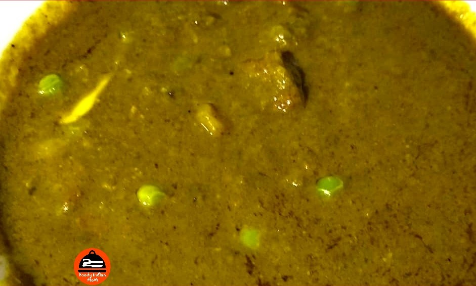

Palak Matar Curry is a vegetarian dish which is very simple and easy to make, consisting of thick paste made from pureed spinach and green peas seasoned with different aromatic spices. In this Spicy Palak Matar Curry fresh and sweet green peas are coated in spicy spinach (Palak) curry.

    

Healthwise this dish is very healthy and nutritious and on the other side taste wise this curry is so yummy that you will eat two extra rotis with this curry.Palak(Spinach) and Matar (Green Peas) both are rich in antioxidants and nutrients which make the dish more healthy.

This Spicy Palak curry served hot with Chapati and Jeera Rice. This Palak Matar Curry is on the menu in many restaurants. People enjoy eating this spicy palak matar curry for lunch and dinner.

Here is how to make this Palak Matar Curry

    

        <dl class="row">
            <dt class="col-sm-4">Cuisine</dt><dd class="col-sm-7">North Indian</dd>
            <dt class="col-sm-4">Course</dt><dd class="col-sm-7">Lunch And Dinner</dd>
            <dt class="col-sm-4">Diet</dt><dd class="col-sm-7">Vegetarian</dd>
            <dt class="col-sm-4">Equipments</dt><dd class="col-sm-7">Kadai (Wok) / Heavy Bottomed Pan</dd>
        </dl>
    

    

        <dl class="row">
            <dt class="col-sm-5">Prep. Time</dt><dd class="col-sm-7">20 mins</dd>
            <dt class="col-sm-5">Cooking Time</dt><dd class="col-sm-7">20 mins</dd>
            <dt class="col-sm-5">Total Time</dt><dd class="col-sm-7">40 mins</dd>
            <dt class="col-sm-5">Makes</dt><dd class="col-sm-7">2 Servings</dd>
        </dl>
    

    
<h5 class="font-weight-bold">Ingredients</h5>

    

        <ul class="post-list" style="line-height: 200%">
            <li>250 gms Spinach Leaves(1 big bunch)</li>
            <li>½ cup Green Peas</li>
            <li>1 chopped Tomato</li>
            <li>2 Onion</li>
            <li>1 Chopped Potato in big cubes</li>
            <li>5-6 clove Garlic</li>
            <li>1 inch Ginger</li>
            <li>Dried Urad Dal vadi</li>
            <li>Salt to taste</li>
            <li>Red chili powder</li>
            <li>Turmeric Powder</li>
            <li>Coriander Powder</li>
            <li>Hing (Pinch)</li>
            <li>Chopped Coriander Leaves</li>
            <li>Oil for Cooking</li>
        </ul>
    

    
<h5 class="font-weight-bold">Recipe Steps</h5>

    

        <ol class="post-list text-justify" style="line-height: 200%">
            <li style="margin-bottom:5px;">Wash the spinach leaves and chopped potato pieces very well in water.</li>
            <li style="margin-bottom:5px;">Boil spinach leaves in a cooker with one cup of water till one whistle. Keep the boiled spinach along with its boiled water in a bowl.</li>
            <li style="margin-bottom:5px;">Prepare Onion Paste and keep it aside.</li>
            <li style="margin-bottom:5px;">Prepare Ginger Garlic paste and keep it aside.</li>
            <li style="margin-bottom:5px;">Heat oil in kadhai and fry dried urad dal vadi in it and keep it aside in a plate.</li>
            <li style="margin-bottom:5px;">In the Same Kadhai add a pinch of hing and then onion paste and cook this until the color of onion changes to golden pink and the raw smell of onion is removed.</li>
            <li style="margin-bottom:5px;">Now add Ginger garlic paste in kadhai and cook the masala very well.</li>
            <li style="margin-bottom:5px;">Grind the boiled spinach leaves in a mixer and make its puree and keep it aside.</li>
            <li style="margin-bottom:5px;">Now make the Puree of Tomato and keep it aside in a bowl.</li>
            <li style="margin-bottom:5px;">Add Tomato puree in kadhai and bhuno (Cook) the masala very well till the oil separates.</li>
            <li style="margin-bottom:5px;">Now add Turmeric Powder,Red chili Powder, Coriander Powder, salt in masala cooked in kadai. Mix Well. Add very little water to the masala so that masala does not get burned and again bhuno the masala till the oil separates.</li>
            <li style="margin-bottom:5px;">Now Add Potato Cubes and Green Peas  into the  masala and mix well  so that each potato and green peas are coated with masala.Cook this for 3-4 minutes.</li>
            <li style="margin-bottom:5px;">Now Add Spinach (Boiled Palak) puree in kadhai and mix well with masala.</li>
            <li style="margin-bottom:5px;">Cover the kadhai with its lid and cook the gravy for 10-12 minutes on low flame.</li>
            <li style="margin-bottom:5px;">After 12 minutes Open the lid of the kadhai and garnish with chopped Coriander leaves and serve hot with Chapati and Jeera Rice.</li>
        </ol>
    

    

        

            <iframe width="100%" height="315" src="https://www.youtube.com/embed/pnDSoWj-y4I" frameborder="0" allow="accelerometer; autoplay; encrypted-media; gyroscope; picture-in-picture" allowfullscreen></iframe>
        

    

 
