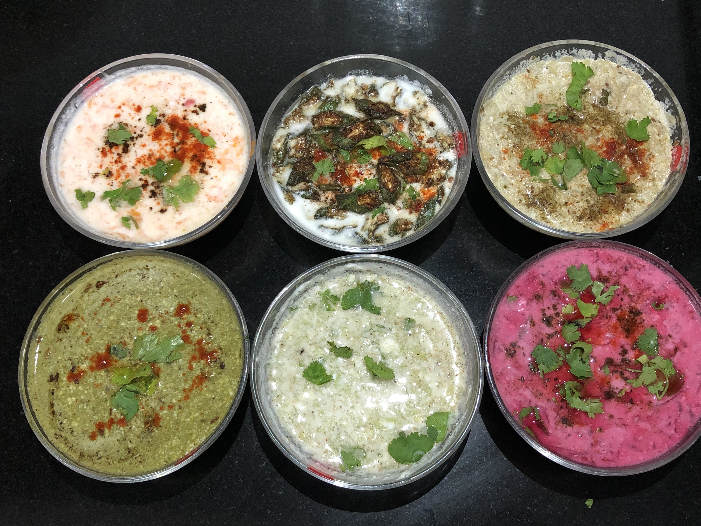

Raita is an Indian dish made of thick creamy curd which is mixed together with either cooked or uncooked vegetables, fruits, herbs and various spices. Here curd is also known as Yoghurt in English and Dahi in Hindi. Raita is served as a side dish in any Indian thali.

    

Raita is considered a power pack of many nutrients and antioxidants in it. Raita is prepared using curd, which is high in protein (Protein Content of curd is higher than Milk) and low in fats. Raita is helpful in digestion  and weight loss.

In India Raita is served with Biryani, kebabs and Pulao. Various aromatic spices like Roasted Jeera Powder, Black salt, dried Mint (Pudina) leaves powder, mustard seeds, Hing etc. that is added in Raita to enhance the taste of it.

Raita helps in cooling down the heat of any spicy foods such as Biryani, Kebabs and Spicy Curry in thali etc. As Raita is made of curd which acts as a cooling agent, it helps in balance the heat from spicy foods. Vegetables like onion, cucumber, bathua etc which are added in Raita also cools down the body. In Western and middle east countries Raita is considered as Dips.

Here is how to make this Raita Recipes

    

        <dl class="row">
            <dt class="col-sm-4">Cuisine</dt><dd class="col-sm-7">North Indian and South Indian</dd>
            <dt class="col-sm-4">Course</dt><dd class="col-sm-7">Lunch and Dinner</dd>
            <dt class="col-sm-4">Diet</dt><dd class="col-sm-7">Vegetarian</dd>
            <dt class="col-sm-4">Equipments</dt><dd class="col-sm-7">Mixing Bowl</dd>
        </dl>
    

    

        <dl class="row">
            <dt class="col-sm-5">Prep. Time</dt><dd class="col-sm-7">20 mins</dd>
            <dt class="col-sm-5">Cooking Time</dt><dd class="col-sm-7">30 mins</dd>
            <dt class="col-sm-5">Total Time</dt><dd class="col-sm-7">50 mins</dd>
            <dt class="col-sm-5">Makes</dt><dd class="col-sm-7">2 Servings</dd>
        </dl>
    

    
<h5 class="font-weight-bold">Ingredients</h5>

    

        <ul class="post-list" style="line-height: 200%">
            <li>6 Cup Dahi(Curd)</li>
            <li>Dry Roasted Cumin (Jeera) Powder</li>
            <li>Black salt</li>
            <li>Salt to taste</li>
            <li>Dried Mint Leaves powder</li>
            <li>Red Chili Powder</li>
            <li>Chaat masala</li>
            <li>Hing</li>
            <li>¼ tbsp Cumin Seeds</li>
            <li>Oil for tadka</li>
            <li>Chopped Green chilies</li>
            <li>Chopped Coriander Leaves</li>
            <li>1 cup Grated Beetroot</li>
            <li>1 cup Grated Carrots</li>
            <li>1 cup Grated Lauki(Bottle Gourd)</li>
            <li>5-6 Diamond cut Bhindi</li>
            <li>1 Grated Cucumber</li>
            <li>1 cup Bathua Puree</li>
        </ul>
        

            <strong>
                <i class="fas fa-lightbulb"></i> Never mix any hot cooked Vegetable with curd. Always cool down the cooked Vegetables at room temperature first and then add curd.
            </strong>
        

    

    
<h5 class="font-weight-bold">Recipe Steps</h5>
 

    

        <ul class="post-list text-justify" style="line-height: 200%">
            <li style="margin-bottom:5px;"><strong>Beetroot Raita</strong>
                <ol class="post-list text-justify" style="line-height: 200%">
                    <li style="margin-bottom:5px;">Take a pan, add one cup of water in it and then add grated beetroot in that pan</li>
                    <li style="margin-bottom:5px;">Boil these grated beetroot for 7-8 minutes. After 7 minutes strain all boiled water and keep the boiled grated beetroot aside in a bowl and let it cool at room temperature.</li>
                    <li style="margin-bottom:5px;">Now take a mixing bowl and add cooked beetroot, 1 cup Curd, Green Chillies, Salt, Black Salt, Cumin powder, Red Chili Powder and mix well. Garnish this Raita with Chopped coriander leaves.</li>
                </ol>
            </li>
            <li style="margin-bottom:5px;"><strong>Bottle Gourd Raita</strong>
                <ol class="post-list text-justify" style="line-height: 200%">
                    <li style="margin-bottom:5px;">Take a kadhai and add 1 tbsp of oil in it.</li>
                    <li style="margin-bottom:5px;">Now add Pinch of Hing, Cumin Seeds, Green Chilies and grated lauki in the kadhai. Mix Well. Add salt in it and cover the kadhai with lid and let it cook for 7-8 minutes on low flame.</li>
                    <li style="margin-bottom:5px;">After 7 minutes Lauki is cooked and transfer cooked lauki in a bowl and cool it at room temperature.</li>
                    <li style="margin-bottom:5px;">In a mixing bowl add cooked lauki(bottle gourd), 1 cup beaten curd, pinch of Salt, Black Salt, Cumin powder, mint leaves powder, Red chili powder and mix well. Garnish this raita with chopped coriander leaves.</li>
                </ol>
             </li>
            <li style="margin-bottom:5px;"><strong>Carrot Raita</strong>
                <ol class="post-list text-justify" style="line-height: 200%">
                    <li style="margin-bottom:5px;">Take a pan and add 1 cup of water in it.</li>
                    <li style="margin-bottom:5px;">Then add grated carrots in that pan and boil these grated carrots for 7-8 minutes.</li>
                    <li style="margin-bottom:5px;">After 7 minutes strain all the boiled water and keep the boiled grated carrots aside in a bowl and let it cool at room temperature.</li>
                    <li style="margin-bottom:5px;">Now take a mixing bowl and add cooked carrot, 1 cup Curd ,Green Chillies, Salt, Black Salt, Cumin powder, mint leaves powder, Red Chili Powder and mix well. Garnish this Raita with Chopped coriander leaves.</li>
                </ol>
            </li>
            <li style="margin-bottom:5px;"><strong>Okra Raita</strong>
                <ol class="post-list text-justify" style="line-height: 200%">
                    <li style="margin-bottom:5px;">Heat Oil In kadhai. Fry all chopped pieces of Bhindi till all pieces become crisp and keep it aside in a plate. Add salt to these fried bhindi and mix well.</li>
                    <li style="margin-bottom:5px;">Now Take a mixing bowl and add curd in it.</li>
                    <li style="margin-bottom:5px;">Now add three fourths of fried bhindi in the curd and then add a pinch of salt , black salt, cumin powder , green chilies, chaat masala, Red chili Powder in it. Mix Well. Garnish it with chopped coriander leaves and left over one fourth fried bhindi pieces.</li>
                </ol>
            </li>
            <li style="margin-bottom:5px;"><strong>Cucumber Raita</strong>
                <ol class="post-list text-justify" style="line-height: 200%">
                    <li style="margin-bottom:5px;">Take a Mixing Bowl and add 1 cup of curd in it.</li>
                    <li style="margin-bottom:5px;">add grated cucumber in it.</li>
                    <li style="margin-bottom:5px;">Now add salt, black salt, Red chili powder, mint leaves powder,cumin powder, Green chilies, chaat masala in the mixing bowl.Garnish it with chopped coriander leaves.</li>
                </ol>
            </li>
            <li style="margin-bottom:5px;"><strong>Bathua ka Raita</strong>
                <ol class="post-list text-justify" style="line-height: 200%">
                    <li style="margin-bottom:5px;">Boil washed bathua leaves in a pressure cooker till one whistle.</li>
                    <li style="margin-bottom:5px;">Now strain the boiled water with the help of strainer. Now grind the cooked bathua leaves in a mixer. Bathua puree is ready now.</li>
                    <li style="margin-bottom:5px;">Cool this bathua puree at room temperature. Take a mixing bowl and add 1 cup curd in it. Add bathua puree in the bowl and mix well. Now add salt, black salt, cumin powder, red chili powder, chaat masala in it and mix well.</li>
                    <li style="margin-bottom:5px;">Garnish it with coriander leaves. Take a tadka pan and add 1 tbsp oil in it. Now add a pinch of hing and jeera (cumin seeds) in the hot tadka pan. Put this tadka in the bathua Raita.</li>
                </ol>
            </li>
        </ul>
    

    

        

            <iframe width="100%" height="315" src="https://www.youtube.com/embed/PHOj-vUIXUI" frameborder="0" allow="accelerometer; autoplay; encrypted-media; gyroscope; picture-in-picture" allowfullscreen></iframe>
        

    

 
