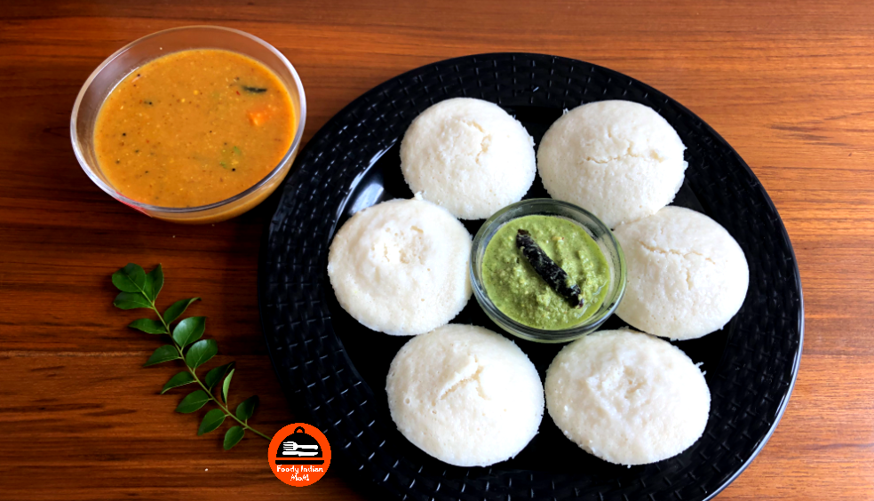

Idli is a soft and fluffy steamed cake made by fermenting batter of soaked rice and white urad Dal together. Idli is a savoury snack originated in South India. It is a popular breakfast item among southindians, but now popular in whole India. Soft and fluffy idli is made up by steaming a fermented batter which  is made up of rice and Black gram dal (washed white urad dal). In ancient India, Idli is made by fermenting only black gram dal, but later Idli is made by using Dal and Rice together. Soaking and fermentation process is very important in making good idlis.

    

Idli is considered a healthy breakfast item normally served with hot Sambhar and Coconut Chutney. As the oil content in idli is very less but the nutrient content in idli  is very high. Idli is a better alternative than fried snacks in india such as Bhajia, Samosa or any fast food items.

Idli is considered as the healthiest breakfast by world health organisation.Idli is steamed breakfast thus the calorie intake is also very less. One Idli gives 33 calories, out of which carbohydrate consists of 28 calories and proteins consists of 4 calories and fat consists of 1 calories.

Idli is an easily digestible breakfast because of the fermentation process which breaks down the starches of the grains so that they are more readily metabolized or in simple words easily digested by the body. Many schools and colleges in India serve Idli ,Sambhar Chutney in their Canteens instead of any fast food considering the health of kids and young Children. Even in Airports across the world ,many indian restaurants sell Idli, Sambhar and chutney with filter coffee or Chai.

In India, leftover idlis are also used as a snack. Fry leftover idli in a little amount of Ghee , Mustard seeds and seasoned with curry powder or gunpowder. There are various types of Idli eaten in India such as button or mini idli, Rava Idli, Ragi idli, Poha idli and kanchipuram idli.

Here is how to make this Soft and fluffy Idli.

    

        <dl class="row">
            <dt class="col-sm-4">Cuisine</dt><dd class="col-sm-7">South Indian Snacks</dd>
            <dt class="col-sm-4">Course</dt><dd class="col-sm-7">Breakfast</dd>
            <dt class="col-sm-4">Diet</dt><dd class="col-sm-7">Vegetarian</dd>
            <dt class="col-sm-4">Equipments</dt><dd class="col-sm-7">Mixing Bowl / Bhagona, Idli Maker Vessel / Idli Pot</dd>
        </dl>
    

    

        <dl class="row">
            <dt class="col-sm-5">Prep. Time</dt><dd class="col-sm-7">18 hrs</dd>
            <dt class="col-sm-5">Cooking Time</dt><dd class="col-sm-7">15 mins</dd>
            <dt class="col-sm-5">Total Time</dt><dd class="col-sm-7">18hrs 15 mins</dd>
            <dt class="col-sm-5">Makes</dt><dd class="col-sm-7">25 - 30 Idlis</dd>
        </dl>
    

    
<h5 class="font-weight-bold">Ingredients</h5>

    

        <ul class="post-list" style="line-height: 200%">
            <li>3 cups Idli Rice</li>
            <li>6 cups of water (soaking rice)</li>
            <li>1.5 cup whole white urad dal</li>
            <li>3 cups of water(soaking urad dal)</li>
            <li>Extra 2-3 cups of water (grinding)</li>
            <li>6-7 Fenugreek Seeds</li>
            <li>Salt to taste</li>
            <li>Little oil for greasing moulds</li>
        </ul>
    

    
<h5 class="font-weight-bold">Recipe Steps</h5>

    

        <ol class="post-list text-justify" style="line-height: 200%">
            <li style="margin-bottom:5px;">Soak the idli rice and white urad dal separately for 5-6 hours.</li>
            <li style="margin-bottom:5px;">Wash 3 cups of Idli rice with water 2-3 times and soaked in 6 cups of  water for 5-6 hours. Add 7-8 fenugreek seeds (in the  same vessel)  while soaking idli rice in water.</li>
            <li style="margin-bottom:5px;">Fenugreek seeds help in making idli soft and spongy.</li>
            <li style="margin-bottom:5px;">Soaking and fermentation process is very important in making soft, white, spongy  and delicious idlis.</li>
            <li style="margin-bottom:5px;">Wash Urad dal with water 2-3 times. Now soak 1.5 cups of  white urad dal in 3 cups of water( in another vessel ) for 5-6 hours.</li>
            <li style="margin-bottom:5px;">Grinding of both the grains (idli rice and urad dal) can be done together or can be done separately and later mix both the batter in a bowl.We can use either of the ways of grinding.Texture and taste of idli remains same for both the grinding process.</li>
            <ul>
                <li style="margin-bottom:5px;"><b>Grinding Together</b>: After 6 Hours, grind both soaked Idli rice( which already contains fenugreek seeds in it) and soaked white urad dal together in a wet grinder. Add appropriate amounts of water while grinding batter so that the consistency of batter should be neither thick or runny. Batter should be more smooth and slightly coarse in texture.</li>
                <li style="margin-bottom:5px;"><b>Grinding Separately</b>: After 6 hours of soaking urad dal, Grind urad dal into a fine batter in a wet grinder. add little water during grinding if necessary. Transfer the urad dal batter in a bowl and keep aside. Now grind the soaked idli rice in a wet grinder. Add a little amount of water during grinding of idli rice. The texture of idli rice batter is slightly coarse in nature.Transfer the idli rice batter in a separate bowl. Mix both the batter together in a another bowl.</li>
            </ul>
            <li style="margin-bottom:5px;">Transfer the batter from the grinding vessel to another big vessel. Keep this big vessel  covered with a lid or some plate in some warm place for 12 hours so that proper fermentation takes place. At Least 8-9 hours of fermentation is must for making good idlis. After 12 hours, the quantity of batter almost  doubles in volume.</li>
            <li style="margin-bottom:5px;">If you want to use the whole batter at once then only you should add salt to the whole batter otherwise do not add salt to the whole batter if you want to store the batter for 1-2 days because salt containing batter becomes sour in taste quickly.</li>
            <li style="margin-bottom:5px;">Unsalted butter can be stored and used safely for 3-4 days if refrigerated.</li>
            <li style="margin-bottom:5px;">Don't stir the batter before filling idli moulds because air which is trapped inside the batter is responsible for making soft  and fluffy idli.</li>
            <li style="margin-bottom:5px;">Boil 3 cups of water in a idli Pot / Idli maker vessel. Now apply oil in each mould of idli maker and pour batter in each mould of idli maker.Place the idli mould tray just above the level of boiling water in a idli pot and the pot or idli maker vessel is covered until the idlis are done.</li>
            <li style="margin-bottom:5px;">Steam idli in the idli moulds in a idli maker for 15-20 minutes.</li>
            <li style="margin-bottom:5px;">After 15 minutes, remove idli from idli mould with the help of a knife or spoon.</li>
            <li style="margin-bottom:5px;">Serve hot with mixed vegetable  coconut Sambhar and coconut chutney.</li>
        </ol>
    

    

        

            <iframe width="100%" height="315" src="https://www.youtube.com/embed/J5n3YNAk2V0" frameborder="0" allow="accelerometer; autoplay; encrypted-media; gyroscope; picture-in-picture" allowfullscreen></iframe>
        

    

 
