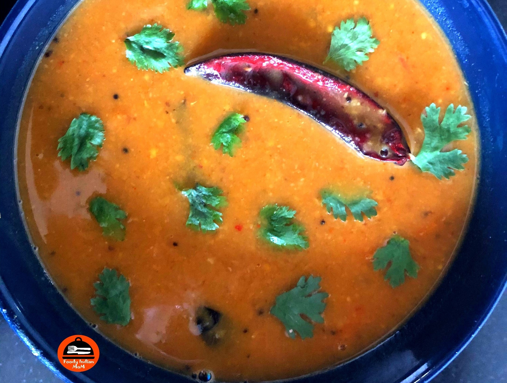

Sambhar is a South Indian lentil and vegetable Soup like dish, cooked with tamarind and various other spices. There is a special spice mixture known as Sambhar Powder which creates magic, thus enhancing the taste of sambhar. The variety of spices, herbs and lentils are used to make this magic masala known as Sambhar Powder.

    

Many delicacies in south india like Dosa, idli, vada and  uttapam  are incomplete without Sambhar. Sambhar is a must item for eating these snacks.

The sambar is rich in proteins ,minerals, Fibre and various vitamins thus make this dish more healthy and nutritious because Sambhar is made up of pulses and vegetables and various spices .Sambhar is considered as one of the  best weight loss foods in India. You can increase or decrease the quantity of vegetables and spices used in sambhar according to your choice to achieve weight loss goals.

In Indian and Srilankan cuisine, Sambhar plays a major role in theirmeal or diet plan. In any Southindian home, Sambhar is prepared almost on a daily basis. There are different kinds of Sambhar like Onions Sambhar, Mixed Vegetable Sambar with or without Coconut, buttermilk Sambar, Drumstick Sambhar, Sambhar with or without Tamarind.

Here is how to make this Mixed Vegetable Coconut Sambhar.

    

        <dl class="row">
            <dt class="col-sm-4">Cuisine</dt><dd class="col-sm-7">South Indian</dd>
            <dt class="col-sm-4">Course</dt><dd class="col-sm-7">Breakfast, Lunch and Dinner</dd>
            <dt class="col-sm-4">Diet</dt><dd class="col-sm-7">Vegetarian</dd>
            <dt class="col-sm-4">Equipments</dt><dd class="col-sm-7">Pressure cooker, Fry Pan, Sauce pan and Tadka Pan</dd>
        </dl>
    

    

        <dl class="row">
            <dt class="col-sm-5">Prep. Time</dt><dd class="col-sm-7">20 mins</dd>
            <dt class="col-sm-5">Cooking Time</dt><dd class="col-sm-7">45 mins</dd>
            <dt class="col-sm-5">Total Time</dt><dd class="col-sm-7">1 hr 5 mins</dd>
            <dt class="col-sm-5">Makes</dt><dd class="col-sm-7">Serve 4 - 5 persons</dd>
        </dl>
    

<section>
    

    

        
<h5 class="font-weight-bold">Ingredients</h5>

    

    

        
            
            <ul style="line-height: 200%">
                <li>1.5 cups Toor Dal/ Arhar Dal / Pigeon Peas</li>
                <li>3.5 cups of Water</li>
                <li>Vegetables Used</li>
                <ul>
                    <li>¾ cup chopped Tomatoes</li>
                    <li>⅓ cup chopped shallots</li>
                    <li>⅓ cup chopped French beans</li>
                    <li>⅓ cup chopped Carrots</li>
                    <li>¾  cup chopped Eggplant/ Brinjal</li>
                    <li>1 green chilli</li>
                    <li>3 tbsp Grated coconut</li>
                    <li>4-5 pieces of dried Tamarind/ Imli</li>
                </ul>
                <li>Spices Used</li>
                <ul>
                    <li>1 tsp Red Chilli Powder</li>
                    <li>1 tsp Turmeric Powder</li>
                    <li>Salt to taste</li>
                    <li>2 tsp oil </li>
                    <li>½ tsp Hing</li>
                    <li>½ tsp Fenugreek seeds</li>
                    <li>3 tbsp Coriander seeds</li>
                    <li>1 tsp Cumin Seeds</li>
                    <li>3-4 Dry Red Chillies</li>
                    <li>1.5 tbsp Chana Dal/ Bengal Gram</li>
                    <li>1 tbsp Sambhar Powder</li>
                </ul>
                <li>For Tadka /Tempering</li>
                <ul>
                    <li>2 tbsp oil</li>
                    <li>½ tsp Hing</li>
                    <li>1 tsp white split Urad dal</li>
                    <li>12-15 fresh curry leaves</li>
                    <li>1 tsp Mustard Seeds</li>
                    <li>2-3 dry red chillies</li>
                </ul>
            </ul>
        

    

</section>

        
<h5 class="font-weight-bold">Recipe Steps</h5>

    

    

        <ol class="post-list text-justify" style="line-height: 200%">
            <li style="margin-bottom:5px;">Wash the Toor Dal well and drain it . Soak Toor dal in water for 15 minutes  prior to cooking. After 15 minutes, transfer soaked dal in a pressure cooker. Add chopped french beans, chopped Shallots, chopped tomatoes, chopped carrots, chopped eggplant  in a pressure cooker. Mix Well. Now add red chili powder, turmeric powder, salt to taste , one slit green chili and 3.5 cups of water in a pressure cooker. Mix well and allow the mixture to boil. When Boiling Takes place then close the lid of the cooker and cook on low flame till  4 -5 whistles.</li>
            <li style="margin-bottom:5px;">Now boil 4-5 pieces of dried imli or tamarind in ½ cup water for 10 minutes in any saucepan .After 10 minutes , allow the mixture to cool down at room temperature. Then remove the seeds of imli and mash it in the same water,  to get Pulpy Tamarind mixture.Keep it aside.</li>
            <li style="margin-bottom:5px;">Now take a fry pan and add 2 tsp oil in it. Add  hing, fenugreek seeds, coriander seeds, cumin seeds, Dry red chilies in oil ,stir it, then add soaked chana dal  in a pan. Mix Well. Cook it for 2-3 minutes on low flame with the lid covered.After 3 minutes, transfer the roasted dal mixture in a bowl and let it cool at room temperature.Grind Roasted dal and coconut together to form a fine paste.Keep  the fine paste  aside in a bowl.</li>
            <li style="margin-bottom:5px;">Open the lid of the cooker and stir dal  vegetable mixture with  a spatula. Add Sambhar powder in sambhar. Mix well. Add tamarind pulpy water mixture in sambhar. Now add Roasted Dal and coconut paste in sambhar. Mix Well. With the help of an electric blender , mash 70% of the sambhar into a creamy sambhar with some chunks of cooked vegetables.</li>
            <li style="margin-bottom:5px;">For giving Tadka, Take a tadka pan and add 2 tbsp oil in it. Add hing, white split urad dal,curry leaves, mustard seeds, dry red chillies in oil . Pour this tadka in sambhar.Mix Well.</li>
            <li style="margin-bottom:5px;">Serve hot sambhar with Dosa, Idli, Uttapam, Vada and ghee rice.</li>
        </ol>
        
<i class="fas fa-lightbulb"></i> You can add other types of vegetables in this sambhar like drumsticks, bottle gourd(lauki), Pumpkin etc , but be careful about the portions of vegetables used in sambhar.

        
<i class="fas fa-lightbulb"></i> Use only 3-4 types (any combination of vegetables) of vegetables for a more distinctive taste of that vegetable in sambhar.

        
<i class="fas fa-lightbulb"></i> If you think that your sambhar is quite thick then add appropriate hot water in it to correct its consistency.

        
<i class="fas fa-lightbulb"></i> If you think that your sambhar is quite runny then add a slurry of water and rice flour mixture in the ratio of 2:1(Water: Rice flour). Then let the sambhar come to a boil after adding mixture of water and rice flour.

    

    

        

            <iframe width="560" height="315" src="https://www.youtube.com/embed/6f5wQQV17eo" frameborder="0" allow="accelerometer; autoplay; encrypted-media; gyroscope; picture-in-picture" allowfullscreen></iframe>
        

    

 