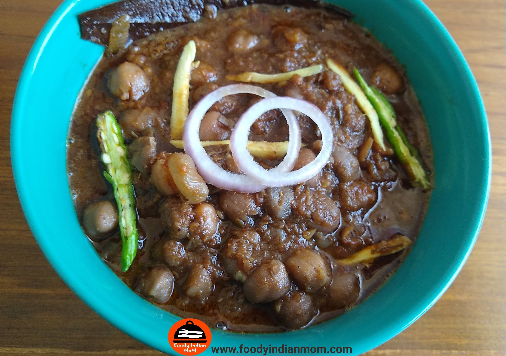

Amritsari chola is the traditional authentic Punjabi dish which is prepared by using Kabuli chana , ginger garlic masalas and a variety of indian spices. This punjabi style amritsari chola is different in colour and flavour of regular Kabuli chola gravy. Amritsari chola is dark in colour because of using tea powder or tea bags while boiling Kabuli Chole.

    

This traditional Amritsari chola recipe originated in Punjab, a state in North India. But now Amritsari chola is quite popular in India and abroad.Many eateries from highway Dhaba to 5 star Restaurants ,all of them serve this dish with Naan specially Garlic  Butter Naan, Tandoori Roti, Kulcha either plain or stuffed and Jeera rice.

Many people sell aloo tikki chaat with Amritsari chole and garnish with spicy and tangy Green chutney and sweet imli khajoor red chutneys. Many other chaat walas sell chaat like Samosa chaat, Karela Chaat etc along with Amritsari chole. I love to eat Amritsari Chole with Pudina Butter naan. Everyone has their own liking  and disliking about their food combinations like some people simply love to eat Amritsari chole with Rice and others can prefer amritsari chola with Naan and kulcha.

Try this delicious recipe in your home and enjoy its flavours with your loved ones.

Here is how to make this Amritsari Chole

    

        <dl class="row">
            <dt class="col-sm-4">Cuisine</dt><dd class="col-sm-7">North Indian</dd>
            <dt class="col-sm-4">Course</dt><dd class="col-sm-7">Lunch And Dinner</dd>
            <dt class="col-sm-4">Diet</dt><dd class="col-sm-7">Vegetarian</dd>
            <dt class="col-sm-4">Equipments</dt><dd class="col-sm-7">Pressure cooker, kadhai</dd>
        </dl>
    

    

        <dl class="row">
            <dt class="col-sm-5">Prep. Time</dt><dd class="col-sm-7">8 hours 25 mins</dd>
            <dt class="col-sm-5">Cooking Time</dt><dd class="col-sm-7">30 mins</dd>
            <dt class="col-sm-5">Total Time</dt><dd class="col-sm-7">8 hours 55 mins</dd>
            <dt class="col-sm-5">Makes</dt><dd class="col-sm-7">Serves 4-5 persons</dd>
        </dl>
    

    
<h5 class="font-weight-bold">Ingredients</h5>

    

        <ul class="post-list" style="line-height: 200%">
            <li>1 cup Kabuli Chana/ Chickpeas (Amritsari)</li>
            <li>2 fine chopped medium size Onions</li>
            <li>1 inch Ginger</li>
            <li>3-4 Green Chillies</li>
            <li>6-7 Cloves of Garlic</li>
            <li>1 cup Tomato Puree</li>
            <li>pinch of Baking soda/ Cooking Soda</li>
            <li>2 big black Cardamoms</li>
            <li>1 inch Dalchini</li>
            <li>4-5 Black Peppercorns</li>
            <li>1 tbsp Tea powder</li>
            <li>1 tbsp Coriander Seeds</li>
            <li>¼ tsp Red chili powder</li>
            <li>¼ tsp Chaat Masala</li>
            <li>¼ tsp Garam Masala</li>
            <li>2 tsp Coriander Powder</li>
            <li>¼ tsp Chola Masala</li>
            <li>1 tbsp Crushed Kasuri methi</li>
            <li>Salt To Taste</li>
            <li>Oil For Cooking</li>
            <li>Chopped Coriander Leaves </li>
            <li>Onion Rings for Garnishing</li>
            <li>Muslin Cloth</li>
        </ul>
    

    
<h5 class="font-weight-bold">Recipe Steps</h5>

    

        <ol class="post-list text-justify" style="line-height: 200%">
            <li style="margin-bottom:5px;">Soak kabuli Chana in water for at least 8 hours or overnight.</li>
            <li style="margin-bottom:5px;">First prepare a Masala Potli in which spices and herbs powder like cinnamon, cardamom, Tea Powder,Coriander seeds and black  peppercorns are tied tightly in a muslin cloth and keep it aside.</li>
            <li style="margin-bottom:5px;">Take a pressure cooker and add soaked kabuli chana in 2.5-3 cups of water. Add a pinch of Baking soda while boiling kabuli chana in a cooker.Add little salt and masala potli in the cooker. When the  boiling takes place then immediately close the lid of the cooker and cook it on low flame till 4-5 whistles.After boiling remove and discard masala potli.</li>
            <li style="margin-bottom:5px;">With the help of a hand masher or use spatula to mash 20%-30% of boiled Kabuli Chana in a cooker. This step helps in making gravy thicker. Transfer the kabuli Chana  in a bowl from a cooker.</li>
            <li style="margin-bottom:5px;">Prepare the fine paste of ginger garlic and green chilli  and keep it aside.</li>
            <li style="margin-bottom:5px;">Now add 1.5 tbsp Mustard oil in a Kadhai. Add tejpatta/Bayleaf,Hing / Asafoetida, and then fine chopped onions in oil. Saute the onions till its colour changes to translucent pink and the raw smell of onions gets removed.Now add ginger garlic green chili paste in kadhai. Mix It well .Cook the masala for 7-8 minutes with lid covered at low flame.</li>
            <li style="margin-bottom:5px;">After 8 minutes, add tomato puree in the kadhai and mix well with the masala and cook it for another 6-7 minutes with the lid covered at low flames till oil separates from masala.</li>
            <li style="margin-bottom:5px;">After 7 minutes add red chili powder, Chaat Masala, Garam masala, coriander powder, chola masala and crushed Kasuri methi in the masala . Mix Well. Add little water in the masala so that the raw dry spices do not get burned. Now add salt to taste in masala( Be careful while adding salt as we add little salt while boiling kabuli chana).</li>
            <li style="margin-bottom:5px;">Bhuno or cook the masala so that oil separates from masala and accumulates around corners of kadhai.</li>
            <li style="margin-bottom:5px;">Now add Boiled kabuli chana along with boiled kabuli chana water in the cooked masala. Mix Well. Let it cook for another 5 minutes with the lid open on low flame.Flavourful Amritsari Chole is ready . Garnish with chopped coriander leaves and onion rings.</li>
            <li style="margin-bottom:5px;">Serve hot amritsari chole with Tandoori Roti, Naan and Jeera rice.</li>
        </ol>
        
<i class="fas fa-lightbulb"></i> You can use Regular Tea bags (Not Green tea) (if you have tea bags at time of cooking ) instead of using tea powder.

        
<i class="fas fa-lightbulb"></i> Use Organic Kabuli Chana instead of regular kabuli chana while preparing this dish because organic kabuli chana get soft easily after boiling as compared to regular kabuli chana.

        
<i class="fas fa-lightbulb"></i> Use all the ingredients in the fresh form, either onion paste or ginger garlic paste ,tomato puree etc. Do not use preservatives containing masala paste and canned puree. You will automatically acknowledge the difference in taste when we are using everything fresh and when we are using ready to cook paste and puree.

    

    

        

            <iframe width="100%" height="315" src="https://www.youtube.com/embed/KWLTJFnYaKo" frameborder="0" allow="accelerometer; autoplay; encrypted-media; gyroscope; picture-in-picture" allowfullscreen></iframe>
        

    

 
