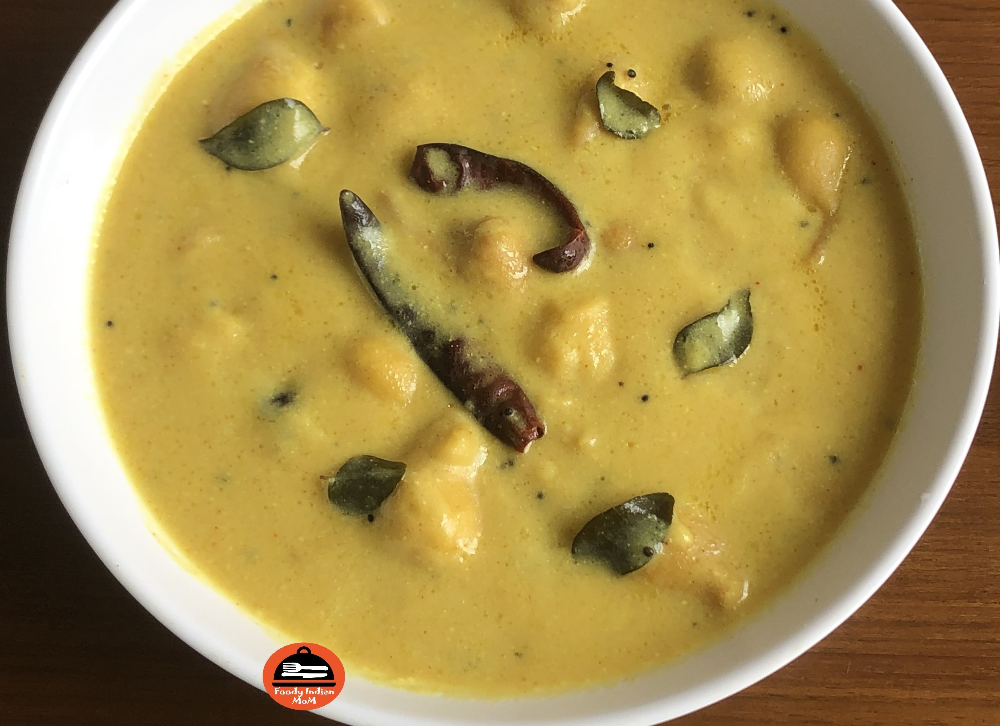

Kadhi Pakora is the sour and mild spicy gravy dish which is prepared by using Gram flour/ Besan , sour curd and various indian spices.  Kadhi can be plain or contain pakora either plain Besan /gram flour Pakora or any vegetable pakora.

    

Almost half of the population in India like to eat Kadhi chawal. Kadhi is considered to be more tasty and flavourful when its pakora remains soft and moist even after cooking in kadhi. Kadhi in India is made in different styles like :
<ul class="post-list" style="line-height: 200%">
    <li>Kadhi without Pakora</li>
    <li>Kadhi with plain (besan/gram flour) pakora</li>
    <li>Kadhi with Boondi</li>
    <li>Kadhi with any vegetable pakora like onion pakora, potato pakora, spinach pakora etc</li>
    <li>Sindhi Kadhi is made directly by sauteing vegetables in oil and adding Besan curd mixture.</li>
    <li>Gujrati Kadhi is slightly sweet in taste as gujrati people add jaggery or sugar while cooking Kadhi.</li>
</ul>

On the health and taste aspects also this Palak Paneer scores in top 10 vegetarian gravies in India. It is very nutritious as Spinach is used as a base of this gravy which has a large amount of benefits like spinach is rich in iron, potassium ,magnesium, zinc, vitamins, fibre etc. On the ground of taste, this palak paneer is best in taste, texture, richness and creaminess.

Here I am going to tell about the  kadhi which is famous in Uttar Pradesh (Lucknow). This kadhi is slightly thick  in texture and spicy and sour in taste. In my hometown khadi is made by adding  plain Besan/ gram flour Pakora. At my place Kadhi is a recommended dish for most of the auspicious occasions. In this blog, I share some tips to make soft pakora for kadhi. These tips are mentioned below in the steps / procedure followed to make kadhi.

Kadhi is usually served  with plain  steam rice. Many people prefer to eat ghee rice with kadhi. Pulao, khichdi is also eaten with kadhi in some places in India like West Bengal, Bihar. Many people in India used to give tadka of fine chopped onions and green chillies in kadhi. Different People make different styles of kadhi, but the fact is everyone likes their own versions of kadhi. I Love  kadhi  so much that I can eat kadhi  with  or without  Rice.

Try this Recipe and enjoy this kadhi with your loved ones. Here is how to make this Kadhi Pakoda

    

        <dl class="row">
            <dt class="col-sm-4">Cuisine</dt><dd class="col-sm-7">North Indian</dd>
            <dt class="col-sm-4">Course</dt><dd class="col-sm-7">Lunch And Dinner</dd>
            <dt class="col-sm-4">Diet</dt><dd class="col-sm-7">Vegetarian</dd>
            <dt class="col-sm-4">Equipments</dt><dd class="col-sm-7">Mixing Bowl, Big Kadhai</dd>
        </dl>
    

    

        <dl class="row">
            <dt class="col-sm-5">Prep. Time</dt><dd class="col-sm-7">10 mins</dd>
            <dt class="col-sm-5">Cooking Time</dt><dd class="col-sm-7">30 mins</dd>
            <dt class="col-sm-5">Total Time</dt><dd class="col-sm-7">40 mins</dd>
            <dt class="col-sm-5">Makes</dt><dd class="col-sm-7">Serves 6-8 persons</dd>
        </dl>
    

    
<h5 class="font-weight-bold">Ingredients</h5>

    

        <ul class="post-list" style="line-height: 200%">
            <li>1 cup + ½ cup  Besan/ Gram Flour</li>
            <li>¾  cup Sour Curd/ Dahi</li>
            <li>1+½ tsp Turmeric Powder</li>
            <li>1+ ½ tsp Red Chili Powder</li>
            <li>1 tsp Coriander Powder</li>
            <li>3 cups of water + 1 cup Water</li>
            <li>Salt to taste</li>
            <li>Oil for frying</li>
            <li>For Tadka / Tempering</li>
            <ul>
                <li>1.5 tbsp oil</li>
                <li>½ tsp hing</li>
                <li>1 tsp Mustard Seeds</li>
                <li>½ tsp Cumin Seeds/ Jeera</li>
                <li>6-7 Dry Red Chillies</li>
                <li>10-12 Curry leaves</li>
            </ul>
        </ul>
    

    
<h5 class="font-weight-bold">Recipe Steps</h5>

    

        <ol class="post-list text-justify" style="line-height: 200%">
            <li style="margin-bottom:5px;">Boil 1 cup water in a pan to make batter for kadhi Pakora.</li>
            <li style="margin-bottom:5px;">Take a mixing bowl and add 1 cup Besan/ Gram flour in it. Add ½ tsp turmeric Powder, ½ tsp Red chilli powder and salt to taste  in the mixing bowl. Dry mix all ingredients .Then add warm water in the dry mix and do whisking of batter in one direction .Due to beating of batter in one direction ,air trapped in batter is responsible for making soft pakora for kadhi. After Whisking , the batter should have a creamy texture with no lumps. Batter should be of medium consistency, neither thick nor runny.</li>
            <li style="margin-bottom:5px;">Heat oil in a kadhai . Just  Before making pakora , add 2 tsp hot oil from kadhai  and add  this to the batter. (Adding oil in batter helps in getting moist pakora and pakora will remain moist for a long time) . Mix well in one direction .Then  start pouring small portions from batter called pakora in oil. When the pakora gets fried ,transfer all the pakora  to a plate and let it cool at room temperature.</li>
            <li style="margin-bottom:5px;">Take another Mixing Bowl and add ½ cup Besan/ Gram Flour In it. Add ¾ cup Sour curd in the mixing bowl. Mix Well. Add  1 tsp red chili powder, 1  tsp turmeric Powder, 1 tsp coriander Powder and salt to taste in mixing bowl.Mix well. Add 3 cups of water in a mixing bowl. Mix it well with no lumps with the help of an electric blender or hand blender.This is a Besan Curd water mixture.</li>
            <li style="margin-bottom:5px;">Add 1.5 tbsp oil in a kadhai. Add hing, mustard seeds, Cumin Seeds, dry red chillies,curry leaves in the oil. When Mustard seeds, Cumin seeds and curry leaves start to sputter then immediately add Besan curd water mixture.Mix it Well. Let the Water and gram flour mixture come to a boil. Then add Pakora in kadhi . Let the kadhi cook for 12-14 minutes on low to medium flame . After 14 minutes kadhi starts thickening, then switches off the gas and covers the kadhai with a lid.</li>
            <li style="margin-bottom:5px;">Serve hot Kadhi with Steam rice, Roti, Tomato Onion Salad, Papad and Achar.</li>
        </ol>
        
<i class="fas fa-lightbulb"></i> If you want more spicy curry then in the last add one more tadka. Take a tadka pan and add oil in it . Add 2-3 fine chopped green chilies, 1 tsp Red chili powder, a big pinch of grated ginger in the oil. Cook this for 1-2 minute and add this tadka in the kadhi.

        
<i class="fas fa-lightbulb"></i> If you think that your kadhi is runny then take a tawa and add Besan/ gram flour on tawa. Roast it for 1-2 minutes. Add this roasted besan/ gram flour in kadhi and boil it. Kadhi starts to thickens.

        
<i class="fas fa-lightbulb"></i> When Kadhi gets cold  at room temperature then it starts thickens very easily so don't over thicken the kadhi while cooking.

        
<i class="fas fa-lightbulb"></i> You can try  different vegetable pakora in kadhi like spinach pakora kadhi , onion pakora kadhi, Potato and green chilli pakora kadhi etc.

    

    

        

            <iframe width="100%" height="315" src="https://www.youtube.com/embed/fMkKQbaXGXE" frameborder="0" allow="accelerometer; autoplay; encrypted-media; gyroscope; picture-in-picture" allowfullscreen></iframe>
        

    

 
