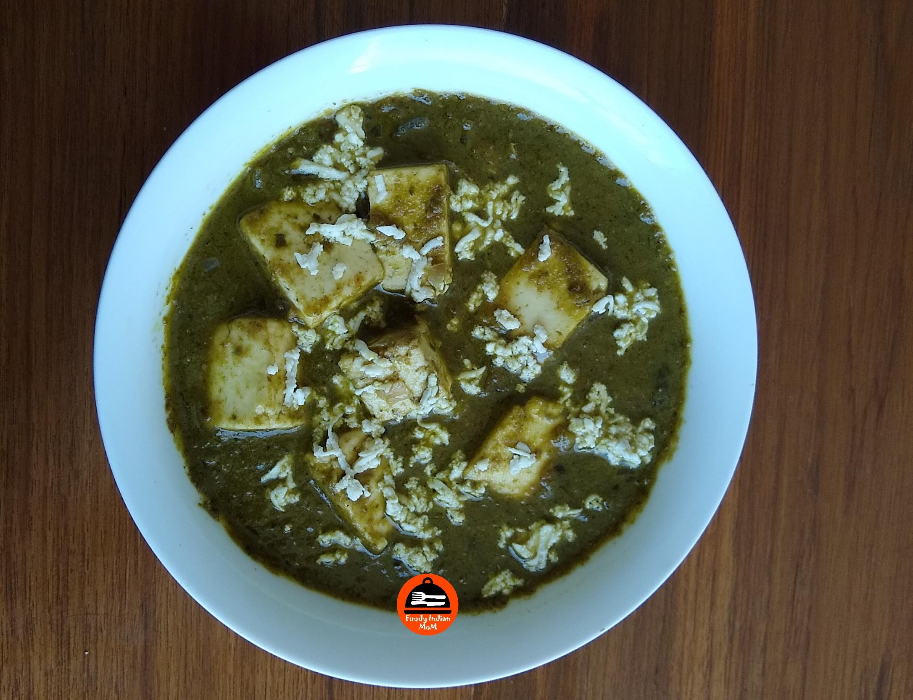

Palak Paneer is a delicious vegetarian curry dish consisting of butter tossed Paneer cubes dipped in creamy spinach masala gravy. This vegetarian curry originated in Punjab, a place in North India where this dish is considered to be staple food.

    

Here in this blog I prepared Palak Paneer by adding lightly fried paneer cubes in thick green gravy of spinach, ginger, garlic, tomatoes, fresh cream and various other spices. Please follow the whole recipe and tips to create wonders in the kitchen. In any Indian home, when there is any special occasion then Palak Paneer is one of the food items prepared for vegetarian lovers. Now a days Palak Paneer is famous across the whole world. Many foreigners called this dish “a Green Gravy”.

On the health and taste aspects also this Palak Paneer scores in top 10 vegetarian gravies in India. It is very nutritious as Spinach is used as a base of this gravy which has a large amount of benefits like spinach is rich in iron, potassium ,magnesium, zinc, vitamins, fibre etc. On the ground of taste, this palak paneer is best in taste, texture, richness and creaminess.

Try this Healthy and delicious Palak Paneer in your home and enjoy its flavours with Roti, Butter Naan and Jeera Rice.

Here is how to make this Palak Paneer

    

        <dl class="row">
            <dt class="col-sm-4">Cuisine</dt><dd class="col-sm-7">North Indian</dd>
            <dt class="col-sm-4">Course</dt><dd class="col-sm-7">Lunch And Dinner</dd>
            <dt class="col-sm-4">Diet</dt><dd class="col-sm-7">Vegetarian</dd>
            <dt class="col-sm-4">Equipments</dt><dd class="col-sm-7">Kadai (Wok)</dd>
        </dl>
    

    

        <dl class="row">
            <dt class="col-sm-5">Prep. Time</dt><dd class="col-sm-7">20 mins</dd>
            <dt class="col-sm-5">Cooking Time</dt><dd class="col-sm-7">30 mins</dd>
            <dt class="col-sm-5">Total Time</dt><dd class="col-sm-7">50 mins</dd>
            <dt class="col-sm-5">Makes</dt><dd class="col-sm-7">Serves 4 persons</dd>
        </dl>
    

    
<h5 class="font-weight-bold">Ingredients</h5>

    

        <ul class="post-list" style="line-height: 200%">
            <li>300-350 gm Spinach leaves</li>
            <li>200 gm Paneer</li>
            <li>2-3 green chillies</li>
            <li>1 inch Ginger</li>
            <li>1 cup fine chopped Onions</li>
            <li>1 cup Tomato Puree</li>
            <li>5-6 cloves of Garlic</li>
            <li>1 tsp Cumin seeds/ jeera</li>
            <li>1 Tejpatta / Bayleaf</li>
            <li>3 cloves/ laung</li>
            <li>1 inch Cinnamon</li>
            <li>2 big black cardamoms</li>
            <li>5 black peppercorns</li>
            <li>small piece of star anise</li>
            <li>Pinch of Hing/ Asafoetida</li>
            <li>¼ tsp Garam Masala</li>
            <li>1 tsp Coriander powder</li>
            <li>¼ tsp Kasuri Methi Powder</li>
            <li>2 tbsp oil</li>
            <li>1 tbsp Butter</li>
            <li>½ cup Fresh cream</li>
            <li>Salt to taste</li>
        </ul>
    

    
<h5 class="font-weight-bold">Recipe Steps</h5>

    

        <ol class="post-list text-justify" style="line-height: 200%">
            <li style="margin-bottom:5px;">In a kadhai, add 3 cups of water. Add 1 tsp salt in water and boil it .Then add spinach leaves in water and boil it for 3-4 minutes. After 4 minutes, transfer the boiled spinach leaves from boiling water to a bowl containing chilled water for 2-3 minutes.This step is called blanching of spinach leaves.</li>
            <li style="margin-bottom:5px;">Grind blanched spinach leaves without water in an electric blender. Now Spinach puree is ready. Keep it aside in a bowl.</li>
            <li style="margin-bottom:5px;">Make a fine paste of ginger,garlic,green chilli and cumin seeds in a blender and keep it aside in a bowl.</li>
            <li style="margin-bottom:5px;">Cut Paneer block into smaller cubes. Take another kadhai and add 2 tbsp oil and 1 tbsp butter in it. Fry these paneer cubes in oil for 1 minutes. Don't overfry them , the colour and shape of paneer cubes should be the same as before.(Toss paneer cubes in hot oil butter mixture for 1 minutes). Keep all fried paneer cubes in absorbent paper in a plate and keep it aside.</li>
            <li style="margin-bottom:5px;">In the same oil which is left in the kadhai, add tejpatta, cloves, cardamoms, peppercorns, cinnamon, small pieces of star anise . Now add a pinch of hing and then add chopped onions in the kadhai. Saute the fine chopped onions till the colour of changes to translucent pink and raw smell (kaccha pan)of onions get removed. Then add garlic, green chili, ginger and cumin seeds paste in kadhai. Mix it well.Cook the masala for 3-4 minutes on low flame with the lid covered.</li>
            <li style="margin-bottom:5px;">After 4 minutes open the lid of the kadhai, stir the masala and then add tomato puree, garam masala, coriander powder, crushed kasuri methi powder in a kadhai .Mix it Well. Bhuno the whole masala with lid covered for 4-5 minutes on low flame till oil separates from masala.</li>
            <li style="margin-bottom:5px;">Now add spinach puree in the cooked masala. Mix it well. Cook the whole gravy for another 5-6 minutes on low flame.  Add salt to taste in a gravy. Now add  fresh cream in the gravy . Mix it well. Cook the whole gravy for another 2 minutes.</li>
            <li style="margin-bottom:5px;">After 6 minutes add oil butter tossed paneer cubes  in a spinach gravy and cook it for 2-3 minutes so that the panner absorbs the flavour of Spinach gravy. Creamy Palak Paneer is ready to serve.</li>
            <li style="margin-bottom:5px;">Serve hot palak paneer with butter Naan or tandoori Roti and Jeera Rice.While serving add 1 tsp of butter in each bowl.</li>
        </ol>
        
<i class="fas fa-lightbulb"></i> Do Not add red chili powder, black pepper powder and turmeric powder in the curry to maintain the green colour of gravy.If you want to make spicy gravy then add  spicy green chili paste  while cooking gravy.

        
<i class="fas fa-lightbulb"></i> To increase the creaminess add every ingredient in fine paste form like onion paste, dry spices paste etc and add lots of cream in the gravy.

        
<i class="fas fa-lightbulb"></i> Don't cook any  spinach gravy (Palak Paneer) in iron kadhai or vessels because iron in kadhai reacts with spinach and tomatoes in kadhai and makes the colour of gravy dark greenish black ,which does not look appealing. Cook this palak paneer in nonstick or stainless steel utensils.

        
<i class="fas fa-lightbulb"></i> Many people used to give tadka of chopped garlic and dry red chillies in the prepared Palak paneer .If you want to add tadka ,you can add it otherwise it's not necessary.Its depend on person to person taste palette , Some people prefer to eat more garlic than others. Because palak paneer gravy already contains garlic in it.

        
<i class="fas fa-lightbulb"></i> You can also add green peas in the curry while cooking Palak paneer gravy then another dish called Palak matar Paneer is ready.

        
<i class="fas fa-lightbulb"></i> Leftover Palak paneer can also be used by kneading dough with a gravy of Palak paneer and grated Paneer cubes. You can make Paratha or Puri from this dough.

    

    

        

            <iframe width="100%" height="315" src="https://www.youtube.com/embed/FRHr6n5NjI0" frameborder="0" allow="accelerometer; autoplay; encrypted-media; gyroscope; picture-in-picture" allowfullscreen></iframe>
        

    

 
